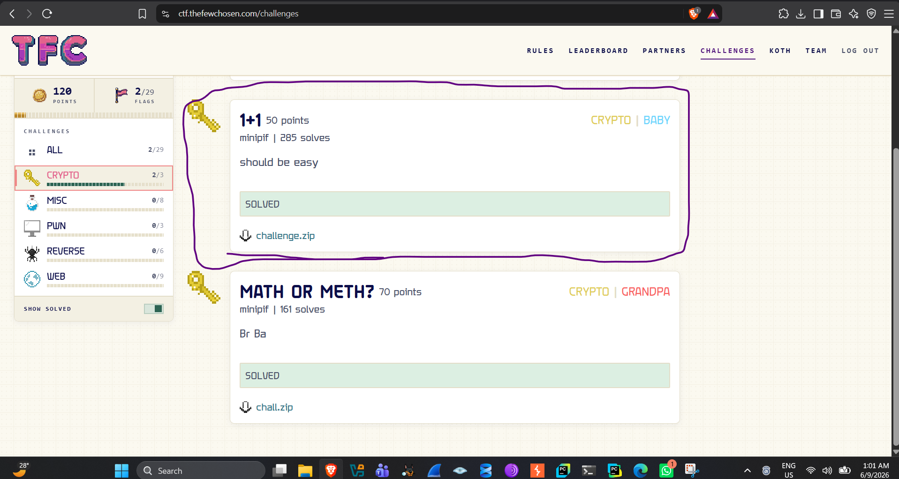
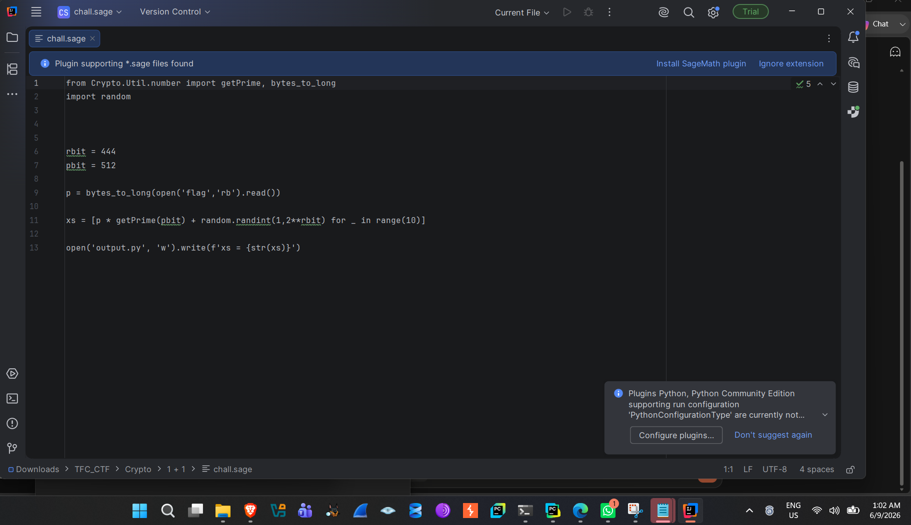
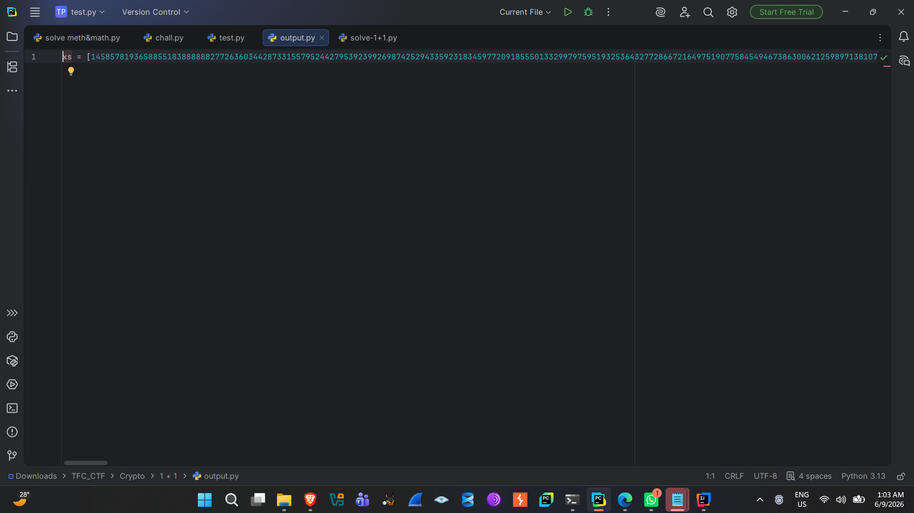
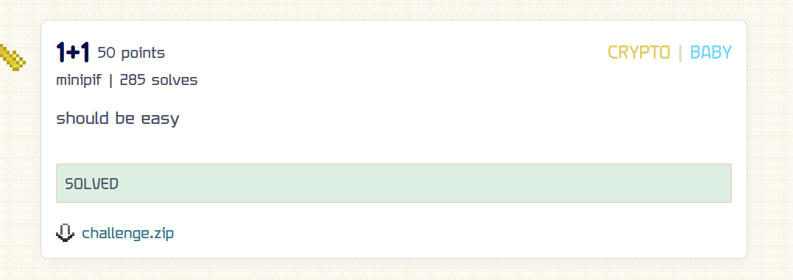

1 + 1 --- Crypto / BABY (50 pts)

Category: Crypto \| Difficulty: BABY \| Points: 50 \| Author: minipif

Files provided: challenge.zip → chall.sage, output.py

1\. Challenge Overview

The challenge portal presents a small crypto category with a handful of
solves already on the board. \"1 + 1\" ships a single archive,
challenge.zip, containing the generation script (chall.sage) and the
resulting output (output.py). There is no live service to connect to ---
this is a pure \"recover the secret from the math\" challenge, which is
the hallmark of a lattice / LLL problem.

*Figure 1 --- Challenges page (TFC CTF), Crypto category open*

2\. Source Code Analysis --- chall.sage

The generation script is short but deliberate. Screenshot below shows
the actual source as provided in the challenge archive:

*Figure 2 --- chall.sage: flag is read as an integer and combined with
random primes and noise*

Reproduced as text for reference:

from Crypto.Util.number import getPrime, bytes_to_long

import random

rbit = 444

pbit = 512

p = bytes_to_long(open(\'flag\', \'rb\').read())

xs = \[p \* getPrime(pbit) + random.randint(1, 2\*\*rbit) for \_ in
range(10)\]

open(\'output.py\', \'w\').write(f\'xs = {str(xs)}\')

Breaking this down:

-   p = bytes_to_long(open(\'flag\',\'rb\').read()) --- the flag itself,
    read as raw bytes, is converted into an integer p. This is the
    secret we need to recover.

-   getPrime(pbit) --- for each of the 10 iterations, a fresh,
    independent 512-bit prime q_i is generated.

-   random.randint(1, 2\*\*rbit) --- a noise term r_i, bounded by
    2\^444, is added on top.

The final sample is: x_i = p·q_i + r_i, for i = 0..9, where p is fixed
and unknown (the flag), q_i is a fresh random 512-bit prime per sample,
and r_i is noise with 0 \< r_i \< 2\^444.

Ten of these x_i values are dumped to output.py. This structure --- a
shared \"big\" multiplier times a random large value, plus small
independent noise --- is the textbook setup for an Approximate Common
Divisor (ACD) problem.

3\. Output Analysis --- output.py

The output file is a single Python list assignment containing the ten
leaked samples:

*Figure 3 --- output.py loaded in the IDE, showing the xs list of ten
large integers*

Each x_i is a large integer (roughly 900+ bits --- the product of a
\~512-bit p-derived value and a 512-bit prime, plus noise). We have 10
equations and 11 unknowns (p, plus q_0..q_9), and the noise terms r_i
are unknown too. This looks underdetermined --- but the key insight of
ACD attacks is that we don\'t need to solve for p algebraically; we can
find it as a short vector in a specially built lattice.

4\. The Math: From ACD to Simultaneous Diophantine Approximation

4.1 The Approximate Common Divisor problem

We\'re given x_i = p·q_i + r_i, with \|r_i\| \< 2\^ρ, for i = 0..9, and
ρ = rbit = 444. All the x_i share the same unknown multiplier p, but
each has its own random q_i and small error r_i. This is precisely the
Approximate Common Divisor (ACD) problem: p behaves like an
\"approximate common divisor\" of all the x_i, since x_i mod p = r_i is
small relative to p and q_i.

4.2 Turning it into a rational approximation problem

Divide any sample x_i by the reference sample x_0:

x_i / x_0 = (p\*q_i + r_i) / (p\*q_0 + r_0) ≈ q_i / q_0

The approximation error is small because r_i, r_0 are tiny compared with
p\*q_i. So each ratio x_i / x_0 is a very good rational approximation to
q_i / q_0, even though neither q_i nor q_0 is known individually ---
they\'re only known to be \"close\" in this ratio sense. This is exactly
the setup for Simultaneous Diophantine Approximation (SDA): finding
integers that simultaneously approximate several unknown ratios well,
which can be solved by lattice reduction.

4.3 Why LLL finds q_0 (and hence p)

Construct the lattice basis (rows are basis vectors, 10-dimensional):

\[ 2\^(ρ+1) x1 x2 \... x9 \]

\[ 0 -x0 0 \... 0 \]

\[ 0 0 -x0 \... 0 \]

\[ \... \]

\[ 0 0 0 \... -x0 \]

Any integer vector in the lattice spanned by these rows has coordinates
v0 = u0 · 2\^(ρ+1) and v_i = u0·x_i − u_i·x0 for i = 1..9, where u0, u1,
\... u9 are the integer combination coefficients.

If we pick u0 = q0 and u_i = q_i (the actual primes used during
generation), then substituting x_i = p·q_i + r_i and x_0 = p·q_0 + r_0
gives:

v_i = q0·(p\*q_i + r_i) − q_i·(p\*q_0 + r_0) = q0\*r_i − q_i\*r_0

Since r_i, r_0 \< 2\^444 and q_i, q_0 are \~512-bit, this quantity is
far smaller than a \"random\" integer combination of the huge x_i values
would produce. Once the first coordinate is scaled by 2\^(ρ+1), the
resulting vector v = (q0·2\^(ρ+1), v_1, \..., v_9) is anomalously short
relative to the rest of the lattice.

LLL lattice reduction is exactly the tool for finding such anomalously
short vectors inside a high-dimensional lattice. Feeding it this basis
produces a reduced basis whose first row (for correctly tuned
parameters) is that very vector, from which we recover:

q0 = v0 / 2\^(ρ+1)

Once q0 is known, recovering p is direct:

r0 = x0 mod q0

p = (x0 − r0) / q0

We then verify p by confirming that x_i mod p \< 2\^444 for every
sample. If p is correct, every leftover remainder is exactly the small
noise term r_i added at generation time --- this is a mathematical
verification, not a guess. A wrong p would produce residues spread
uniformly across the full range of p, not confined under 2\^444.

5\. The Sage Exploit Script

solve.sage:

\# solve.sage

load(\'output.py\') \# brings the list \`xs\` into scope

rho = 444

n = len(xs) \# 10 samples

x0 = xs\[0\]

rest = xs\[1:\]

\# Build the lattice basis:

\# row 0: \[2\^(rho+1), x1, x2, \..., x9\]

\# row i: \[0, \..., -x0, \..., 0\] (only entry i is -x0)

M = Matrix(ZZ, n, n)

M\[0, 0\] = 2\^(rho + 1)

for i in range(1, n):

M\[0, i\] = rest\[i - 1\]

M\[i, i\] = -x0

\# LLL-reduce the basis

L = M.LLL()

\# The shortest vector\'s first coordinate is q0 \* 2\^(rho+1)

q0 = abs(L\[0\]\[0\]) // 2\^(rho + 1)

\# Recover p

r0 = x0 % q0

p = (x0 - r0) // q0

\# Sanity check across every sample

assert all((x % p) \< 2\^rho for x in xs)

print(int(p))

Line-by-line explanation:

-   load(\'output.py\') --- imports the ten leaked x_i values directly
    as the Sage variable xs.

-   x0 = xs\[0\], rest = xs\[1:\] --- the first sample is the reference
    x0; the lattice construction treats the remaining nine relative to
    it.

-   M = Matrix(ZZ, n, n) --- builds the lattice basis described in
    Section 4.3, over the integers.

-   M\[0,0\] = 2\^(rho+1), M\[0,i\] = rest\[i-1\] --- the top row is
    (2\^445, x1, x2, \..., x9), matching the target vector\'s
    construction.

-   M\[i,i\] = -x0 --- the diagonal entries encode the -u_i·x0 term from
    the derivation.

-   L = M.LLL() --- Sage\'s built-in LLL reduction searches the lattice
    for a reduced basis; because of the size gap engineered by the
    2\^(ρ+1) scaling factor, the shortest vector in the reduced basis is
    (up to sign) exactly the vector derived above.

-   q0 = abs(L\[0\]\[0\]) // 2\^(rho+1) --- undoes the scaling to
    recover the actual prime q0 used when generating x0.

-   r0 = x0 % q0 and p = (x0 - r0) // q0 --- straightforward integer
    division once q0 is known, recovering the shared secret p.

-   The assert line is the mathematical proof of correctness: for the
    true p, every x_i mod p equals the original noise r_i, strictly less
    than 2\^444. Passing this check across all ten independent samples
    is conclusive confirmation that p was recovered exactly --- not
    guessed.

Running this script in Sage (sage solve.sage) completes in a few
seconds: LLL reduction on a 10-dimensional lattice with \~1000-bit
entries is computationally trivial.

6\. Recovering the Flag

With p recovered as a plain integer, the final step reverses the very
first line of the challenge:

from Crypto.Util.number import long_to_bytes

print(long_to_bytes(p))

This converts the integer p back into its original byte string --- the
flag:

**TFCCTF{nice_crypto_skillz_kid_you_will_be_great_one_day_af56c3}**

*Figure 4 --- Challenge marked SOLVED on the scoreboard after submitting
the recovered flag*

7\. Takeaways

-   Whenever you see the same secret multiplied by several independent
    large random values plus small noise, think Approximate Common
    Divisor.

-   ACD instances reduce cleanly to Simultaneous Diophantine
    Approximation, solvable via a purpose-built LLL lattice.

-   The trick to building the lattice is scaling the target coordinate
    (here, the noise bound 2\^(ρ+1)) so the correct combination of basis
    vectors is provably shorter than any unrelated combination ---
    turning \"find hidden structure\" into \"find the shortest vector,\"
    which LLL solves efficiently even in high dimension.

-   Always validate a recovered secret against every available sample,
    not just one, before declaring victory.
