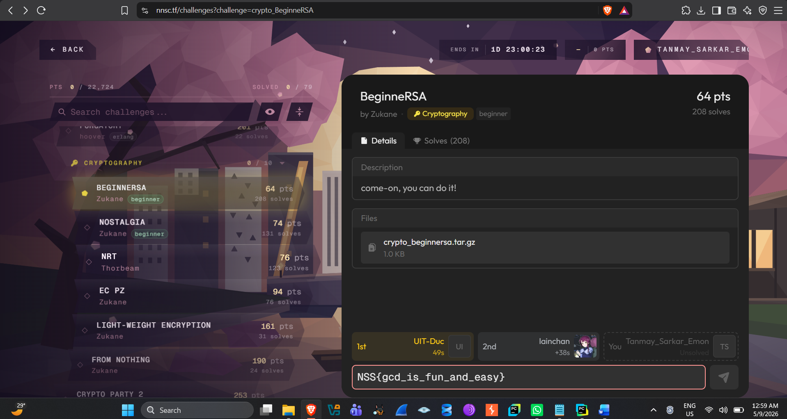
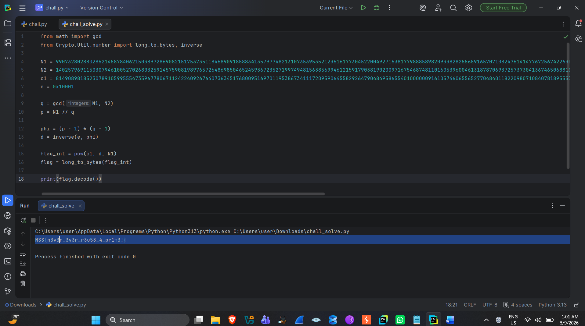
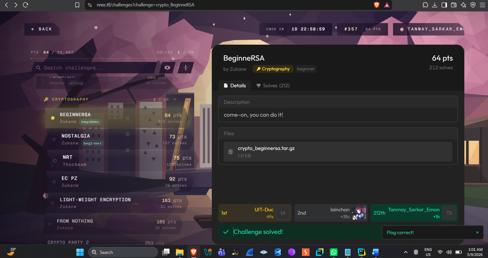

**BeginneRSA --- CTF Writeup**

*Cryptography / RSA --- Common Prime (Shared Modulus Factor) Attack*

Challenge Info

  ----------------------------------- -----------------------------------
  **Platform**                        nnsc.tf

  **Challenge**                       BeginneRSA

  **Category**                        Cryptography

  **Difficulty**                      Beginner

  **Points**                          64 pts

  **Author**                          Zukane

  **Description**                     "come-on, you can do it!"

  **Given File**                      crypto_beginnersa.tar.gz (contains
                                      chall.py and output values: N1, N2,
                                      c1, e)

  **Flag**                            NSS{n3v3r_3v3r_r3u53_4_pr1m3!}
  ----------------------------------- -----------------------------------

1\. Challenge Overview

The BeginneRSA challenge provides a file named crypto_beginnersa.tar.gz,
which contains chall.py (the challenge script) along with an output
file. From the output, two RSA public keys are obtained:

-   N1, e → the first public key

-   N2, e → the second public key (uses the same exponent e)

-   c1 → the flag encrypted with N1

This kind of setup hides a classic RSA vulnerability: if two different
moduli (N1 and N2) share a common prime factor, that shared prime can be
recovered simply by computing gcd(N1, N2) --- after which both N1 and N2
can be factorized.

2\. Vulnerability Analysis

The security of RSA relies on the fact that factoring N = p × q is
computationally hard, as long as p and q are truly independent and
randomly chosen primes. In this challenge, the two given moduli (N1, N2)
were mistakenly generated by reusing one of the two primes --- which is
exactly why the flag itself hints at the bug: "never reuse a prime." The
flaw can be exploited as follows:

-   If gcd(N1, N2) ≠ 1, that gcd is precisely the common prime factor
    shared by both moduli (call it q)

-   Dividing N1 by that q gives the second prime, p (p = N1 / q)

-   Once p and q are known, φ(N1) = (p-1)(q-1) can be computed, and the
    private exponent d = e⁻¹ mod φ(N1) follows directly

-   Decrypting c1 with d then reveals the flag

3\. Solve Script

The attack was implemented in Python using the pycryptodome library:

> from math import gcd
>
> from Crypto.Util.number import long_to_bytes, inverse
>
> N1 = \<N1 value from chall.py\'s output\>
>
> N2 = \<N2 value from the output\>
>
> c1 = \<c1 value from the output (encrypted flag)\>
>
> e = 0x10001
>
> q = gcd(N1, N2) \# common prime factor shared by the two moduli
>
> p = N1 // q \# the other prime factor of N1
>
> phi = (p - 1) \* (q - 1)
>
> d = inverse(e, phi) \# private exponent
>
> flag_int = pow(c1, d, N1)
>
> flag = long_to_bytes(flag_int)
>
> print(flag.decode())

Before running the script, the pycryptodome library was installed via
pip:

> pip install pycryptodome

4\. Execution & Result

Running the script exits with code 0 and prints the flag directly:

> NSS{n3v3r_3v3r_r3u53_4_pr1m3!}

Submitting this flag on the nnsc.tf platform returned a "Challenge
solved! / Flag correct!" confirmation, as shown below.

5\. Screenshots

*Fig 1: Challenge page --- BeginneRSA (nnsc.tf)*

*Fig 2: Output after running the solve script --- flag printed*

*Fig 3: Flag submission --- "Challenge solved!" confirmation*

6\. Key Takeaways

-   When generating multiple RSA keypairs, a prime number should never
    be reused --- sharing a single prime allows an attacker to break the
    modulus instantly using gcd()

-   gcd(N1, N2) is a practical and extremely fast factorization
    technique for an attacker, requiring no brute-force or classical
    factoring algorithm at all

-   Every RSA keypair must be generated using independent,
    cryptographically secure random primes

Tools Used

-   Python 3.13, pycryptodome (for RSA math)

-   PyCharm (writing and running the script)

-   nnsc.tf --- CTF platform (challenge host and flag submission)
