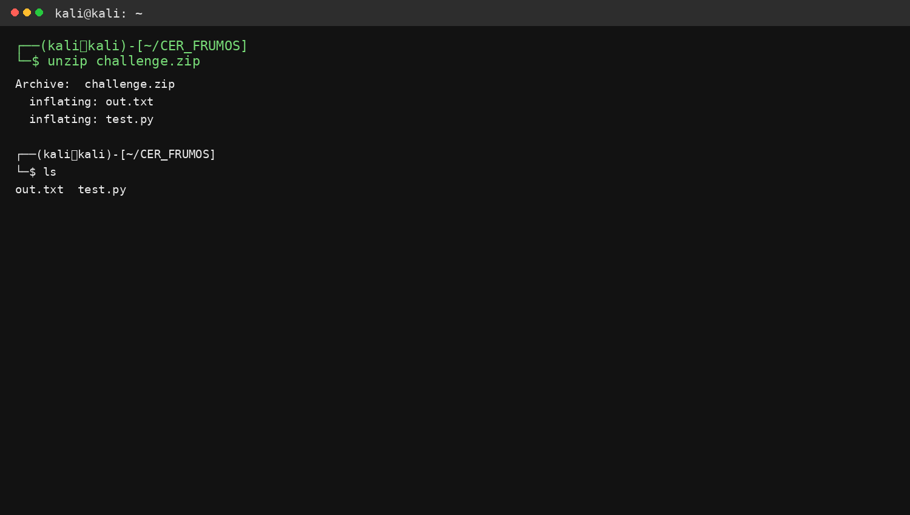
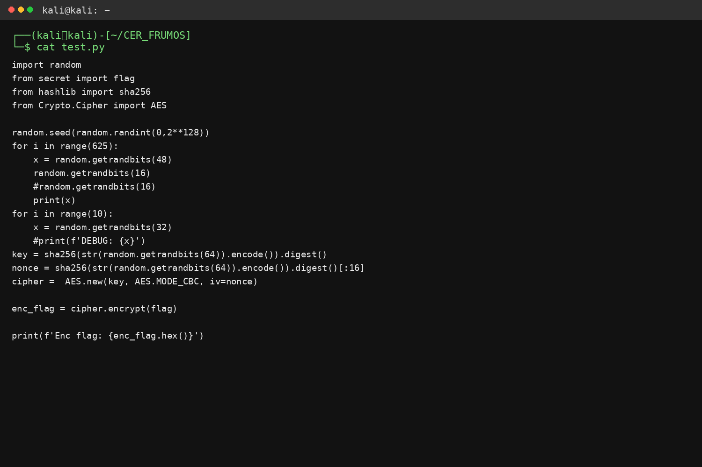
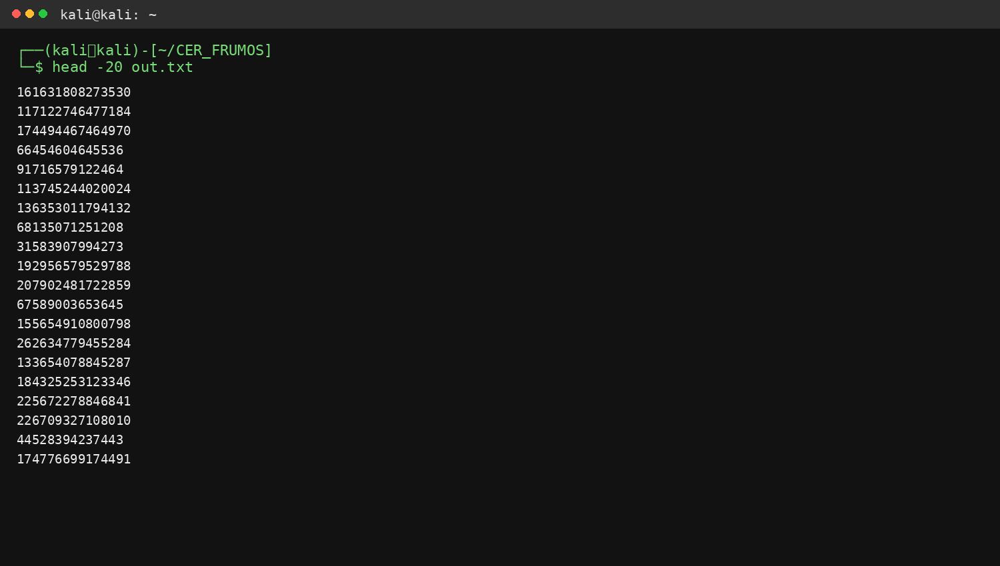
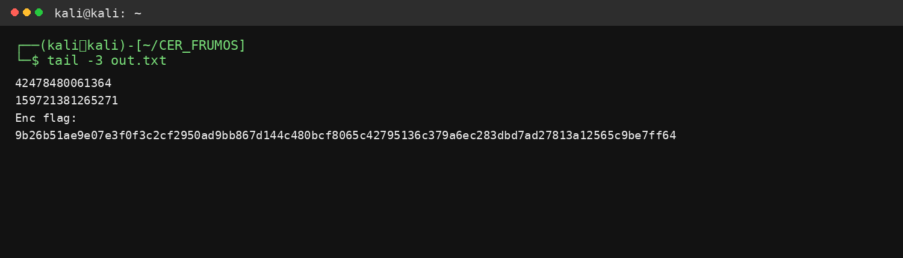
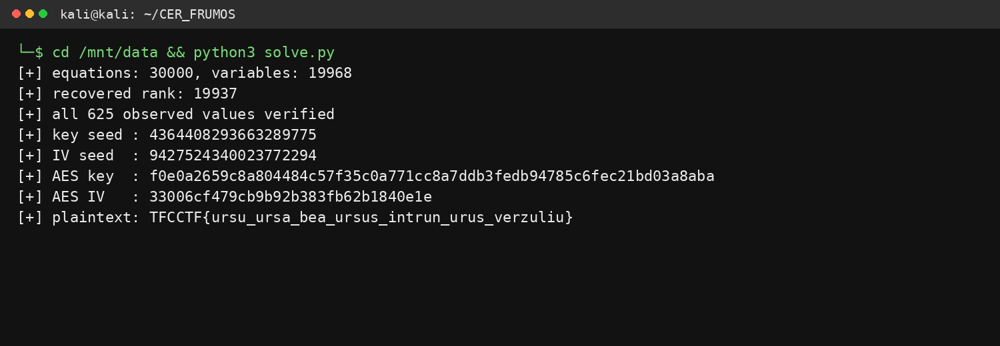
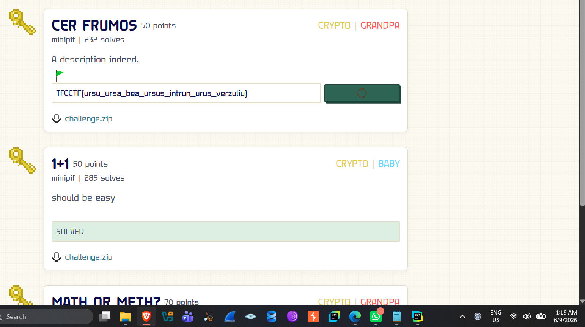

**CTF Writeup**

**CER FRUMOS --- Crypto / Grandpa**

  ------------------- ---------------------------------------------------
  **Team**            Honeypod

  **Challenge**       CER FRUMOS

  **Category**        Crypto (tagged \"Grandpa\")

  **Points**          50

  **Platform**        minipif

  **Description**     "A description indeed."

  **Result**          Solved --- flag captured and submitted
  ------------------- ---------------------------------------------------

1\. Challenge Overview

CER FRUMOS was a 50-point cryptography challenge on the minipif
platform, tagged "Grandpa" alongside the other beginner-crypto
challenges in the set. The challenge provided a single archive,
challenge.zip, containing the server-side source (test.py) and a
transcript of its output (out.txt). The goal was to recover an
AES-encrypted flag by attacking the weaknesses of Python\'s random
module.

*Figure 1. Extracting challenge.zip to reveal out.txt and test.py.*

2\. Source Analysis

Reading test.py shows exactly how the output was generated:

*Figure 2. Contents of test.py.*

The script performs the following steps:

-   Seeds Python\'s random module with random.randint(0, 2\*\*128) ---
    an unknown but fixed seed for the run.

-   Loops 625 times: each iteration calls random.getrandbits(48) and
    prints the value, then calls (and discards) random.getrandbits(16).

-   Calls random.getrandbits(32) ten more times without printing the
    results (pure state consumption).

-   Derives an AES-256 key from sha256(str(random.getrandbits(64))) and
    an IV from the first 16 bytes of
    sha256(str(random.getrandbits(64))).

-   Encrypts the flag with AES-256-CBC using that key/IV and prints the
    ciphertext as Enc flag: \<hex\>.

The output file out.txt contains exactly this: 625 lines of 48-bit
integers followed by the encrypted flag, matching the head/tail below.

*Figure 3. First lines of out.txt --- the leaked 48-bit values.*

*Figure 4. End of out.txt --- the final leaked value and the AES
ciphertext.*

3\. Vulnerability

Python\'s random module is not cryptographically secure: it is a
Mersenne Twister (MT19937) generator with a fully deterministic,
invertible internal state of 624 32-bit words (19,937 bits of entropy).
Every value it ever produces is a fixed, public function of that state.
If an attacker observes enough output bits, the internal state can be
reconstructed exactly, after which every subsequent --- and in this
implementation, every prior --- output can be predicted, including
values that were generated but never printed.

The challenge leaks 48 raw bits per iteration via getrandbits(48), 625
times. That is 30,000 observed bits versus 19,937 unknown state bits,
which is comfortably more equations than unknowns. Each MT19937 output
is a linear function of the seed state over GF(2) (the twist and temper
operations are XOR/shift based), so the entire attack reduces to
building a system of linear equations over GF(2) and solving it --- no
brute force or guessing is required.

4\. Solution Strategy

The solve script (CER_FRUMOS_solve.py) implements a symbolic MT19937:

-   Each of the 624 state words is represented not by a concrete integer
    but by 32 independent symbolic bits, encoded as a big Python integer
    where bit position (word×32 + bit) is a free variable.

-   The twist() and temper() operations are re-implemented bit-for-bit
    (shifts, XORs, and the tempering masks 0x9D2C5680 / 0xEFC60000) but
    operate on these symbolic bit-vectors instead of concrete integers,
    producing one linear GF(2) equation per output bit.

-   Each of the 625 printed getrandbits(48) values contributes 48
    known-bit equations (the full first MT word, plus the top 16 bits of
    the second word used to build the 48-bit output) --- giving 30,000
    equations in 19,937 unknowns.

-   solve_linear() performs Gaussian elimination over GF(2) via
    XOR-based row reduction on that system to recover the original state
    bits.

Once the pre-twist state is recovered, the script re-derives the
generator forward with the concrete (non-symbolic) MT19937
implementation, verifies every one of the 625 observed values matches,
then advances the generator exactly as test.py does: it re-consumes the
ten discarded getrandbits(32) calls and the two getrandbits(64) calls
used for the AES key and IV. Recomputing sha256(str(seed)) for both then
reproduces the exact AES-256 key and IV used by the server, and the flag
is decrypted with OpenSSL in CBC mode.

5\. Running the Solver

Running the solve script against out.txt recovers the internal state,
verifies it against all 625 leaked values, re-derives the AES key/IV,
and decrypts the flag:

*Figure 5. Solver output --- 30,000 equations reduced to a rank-19,937
solution (the full MT19937 state), verification passing, and the
decrypted flag.*

As shown above, the solver reports:

-   30,000 linear equations built from the 625 leaked values, over
    19,968 candidate state-bits (624 words × 32 bits).

-   A recovered rank of 19,937 --- matching MT19937\'s true internal
    entropy exactly, confirming the state was fully (not partially)
    recovered.

-   All 625 observed values verified against the reconstructed
    generator.

-   The recovered key seed, IV seed, resulting AES-256 key and IV, and
    finally the decrypted plaintext flag.

6\. Flag

TFCCTF{ursu_ursa_bea_ursus_intrun_urus_verzuliu}

The flag was submitted on the minipif platform and marked solved:

*Figure 6. CER FRUMOS marked solved on minipif after submitting the
recovered flag.*

7\. Conclusion

CER FRUMOS demonstrates the classic risk of using a non-cryptographic
PRNG for security-relevant secrets: even though the raw seed was never
disclosed, leaking enough linear output bits from Python\'s random
(30,000 bits from 625 calls to getrandbits(48)) was sufficient to fully
reconstruct its 19,937-bit internal state via GF(2) linear algebra. From
there, every other value the generator would ever produce --- including
the values used to derive the AES key and IV --- could be predicted with
certainty, and the flag was recovered without needing to break AES
itself. The general lesson: random must never be used to generate
cryptographic key material; Python\'s secrets module (or another CSPRNG)
is required whenever unpredictability actually matters.

Appendix A: Code Walkthrough

This section explains what each part of CER_FRUMOS_solve.py does,
function by function, before the full listing in Appendix B.

Symbolic state representation

state = \[\[1 \<\< (w\*32+b) for b in range(32)\] for w in range(N)\]
initialises the 624-word MT19937 state not with numbers, but with one
unique power-of-two "variable" per bit (19,968 bits total). Every
operation performed on this state from here on is tracked as a
combination (XOR) of these variables rather than being evaluated
numerically --- this is what lets the script build linear equations
instead of just running the RNG forward.

xorw(a, b)

A small helper that XORs two 32-bit symbolic words together, bit by bit.
XOR is linear over GF(2), so XOR-ing two symbolic bit-vectors is simply
merging their variable sets --- this is the only operation the rest of
the script needs to stay linear.

twist(s)

A direct, bit-for-bit port of CPython\'s MT19937 twist step, but
operating on the symbolic words instead of integers. It reproduces the
exact same construction --- combining the upper bit of word i with the
lower 31 bits of word i+1, conditionally XOR-ing in the twist matrix A =
0x9908B0DF, and mixing in word i+M (wrapping around the 624-word array)
--- so that the symbolic state evolves identically to the real
generator, one bit-variable at a time.

temper(a)

Mirrors CPython\'s output tempering (the right/left shift-and-mask
cascade with constants 0x9D2C5680 and 0xEFC60000) symbolically. This is
the same transform applied to real MT19937 output words before they are
returned to the caller, so applying it to the symbolic words yields, for
each output bit, the exact linear combination of state variables that
produced it.

concrete_twist(s) and temper_int(y)

Ordinary, numeric (non-symbolic) versions of the same two operations.
These are used after the state has been solved, to run the real
generator forward and check its output against the leaked values --- and
to regenerate the values that were consumed by test.py but never printed
(the AES key/IV seeds).

generate_symbolic_outputs(count)

Drives the symbolic twist/temper pair to produce count tempered symbolic
output words in the same sequence test.py\'s calls to random would have
produced them, starting from the very first post-seed twist.

solve_linear(obs)

The core of the attack: Gaussian elimination over GF(2). obs is a list
of (mask, rhs) pairs, one per observed bit --- mask is the symbolic
linear combination of state variables that produced that bit, and rhs is
its observed value (0 or 1). Each equation is XORed against previously
reduced rows sharing its leading variable (pivot), exactly as in
ordinary Gaussian elimination but with XOR replacing subtraction. Once
triangularised, back-substitution recovers each state bit. The function
returns both the solved state and the rank (number of independent
equations) --- a rank equal to 19,937 confirms the entire MT19937 state
was uniquely pinned down.

Reading out.txt and building the equation system

The script parses the 625 leaked 48-bit numbers and the hex-encoded
ciphertext, then for each leaked value adds 32 equations from the first
symbolic MT word and 16 more from the top bits of the second (reflecting
exactly how getrandbits(48) is built from two 32-bit words), for 30,000
equations total --- comfortably enough to cover the 19,937-bit state.

Verification and key/IV re-derivation

After solving, the recovered state is converted to concrete integers and
run forward with the real (non-symbolic) twist/temper functions; every
one of the 625 leaked values is re-checked bit-for-bit against this
reconstruction. The script then advances the generator exactly as
test.py does --- skipping the ten discarded getrandbits(32) calls ---
and pulls the two getrandbits(64) values used for the AES key and IV,
reproducing sha256(str(seed)) for each.

Decryption

Finally, the script shells out to openssl enc -d -aes-256-cbc with the
recovered key and IV to decrypt the ciphertext from out.txt, printing
the plaintext flag.

Appendix B: Full Solve Script (CER_FRUMOS_solve.py)

The complete script used to recover the MT19937 state, verify it,
re-derive the AES key/IV, and decrypt the flag:

#!/usr/bin/env python3\
import sys, subprocess\
from hashlib import sha256\
\
N, M = 624, 397\
A = 0x9908B0DF\
UPPER, LOWER = 0x80000000, 0x7FFFFFFF\
MASK = 0xFFFFFFFF\
VARS = N \* 32\
\
\# Symbolic MT19937: every bit is represented by a bit in a Python
integer.\
state = \[\[1 \<\< (w\*32+b) for b in range(32)\] for w in range(N)\]\
\
def xorw(a, b):\
return \[x \^ y for x, y in zip(a, b)\]\
\
def twist(s):\
\# Same in-place order used by CPython\'s MT19937 implementation.\
o = \[None\] \* N\
for i in range(N-M):\
y = \[0\]\*32; y\[31\] = s\[i\]\[31\]\
for b in range(31): y\[b\] = s\[i+1\]\[b\]\
z = \[0\]\*32\
for b in range(31): z\[b\] = y\[b+1\]\
z = xorw(s\[i+M\], z)\
for b in range(32):\
if (A \>\> b) & 1: z\[b\] \^= y\[0\]\
o\[i\] = z\
for i in range(N-M, N-1):\
y = \[0\]\*32; y\[31\] = s\[i\]\[31\]\
for b in range(31): y\[b\] = s\[i+1\]\[b\]\
z = \[0\]\*32\
for b in range(31): z\[b\] = y\[b+1\]\
z = xorw(o\[i+M-N\], z)\
for b in range(32):\
if (A \>\> b) & 1: z\[b\] \^= y\[0\]\
o\[i\] = z\
i = N-1\
y = \[0\]\*32; y\[31\] = s\[i\]\[31\]\
for b in range(31): y\[b\] = o\[0\]\[b\]\
z = \[0\]\*32\
for b in range(31): z\[b\] = y\[b+1\]\
z = xorw(o\[M-1\], z)\
for b in range(32):\
if (A \>\> b) & 1: z\[b\] \^= y\[0\]\
o\[i\] = z\
return o\
\
def temper(a):\
y = a\[:\]\
z = y\[:\]\
for b in range(21): z\[b\] \^= y\[b+11\]\
y = z\
z = y\[:\]\
for b in range(7, 32):\
if (0x9D2C5680 \>\> b) & 1: z\[b\] \^= y\[b-7\]\
y = z\
z = y\[:\]\
for b in range(15, 32):\
if (0xEFC60000 \>\> b) & 1: z\[b\] \^= y\[b-15\]\
y = z\
z = y\[:\]\
for b in range(14): z\[b\] \^= y\[b+18\]\
return z\
\
def concrete_twist(s):\
o = \[0\]\*N\
for i in range(N-M):\
y = (s\[i\]&UPPER) \| (s\[i+1\]&LOWER)\
o\[i\] = (s\[i+M\] \^ (y\>\>1) \^ (A if y&1 else 0)) & MASK\
for i in range(N-M, N-1):\
y = (s\[i\]&UPPER) \| (s\[i+1\]&LOWER)\
o\[i\] = (o\[i+M-N\] \^ (y\>\>1) \^ (A if y&1 else 0)) & MASK\
y = (s\[N-1\]&UPPER) \| (o\[0\]&LOWER)\
o\[N-1\] = (o\[M-1\] \^ (y\>\>1) \^ (A if y&1 else 0)) & MASK\
return o\
\
def temper_int(y):\
y \^= y \>\> 11\
y \^= (y \<\< 7) & 0x9D2C5680\
y \^= (y \<\< 15) & 0xEFC60000\
y \^= y \>\> 18\
return y & MASK\
\
def generate_symbolic_outputs(count):\
outs = \[\]\
s = twist(state) \# first getrandbits() after seed() twists\
while len(outs) \< count:\
for i in range(N):\
if len(outs) \>= count: break\
outs.append(temper(s\[i\]))\
if len(outs) \< count: s = twist(s)\
return outs\
\
def solve_linear(obs):\
piv = {}\
for mask, rhs in obs:\
row = mask \| (rhs \<\< VARS)\
while True:\
vp = row & ((1 \<\< VARS) - 1)\
if not vp:\
if (row \>\> VARS) & 1: raise RuntimeError(\'inconsistent equations\')\
break\
p = vp.bit_length() - 1\
if p in piv: row \^= piv\[p\]\
else:\
piv\[p\] = row\
break\
sol = 0\
for p in sorted(piv):\
row = piv\[p\]\
rhs = (row \>\> VARS) & 1\
rest = row & ((1 \<\< p) - 1)\
if rhs \^ ((rest & sol).bit_count() & 1): sol \|= 1 \<\< p\
return sol, len(piv)\
\
with open(\'out.txt\', \'r\') as f:\
lines = \[x.strip() for x in f if x.strip()\]\
nums = \[int(x) for x in lines if not x.startswith(\'Enc flag:\')\]\
enc = bytes.fromhex(next(x.split(\':\',1)\[1\].strip() for x in lines if
x.startswith(\'Enc flag:\')))\
assert len(nums) == 625\
\
sym = generate_symbolic_outputs(1889)\
obs = \[\]\
for i, x in enumerate(nums):\
w0, w1 = 3\*i, 3\*i+1\
for b in range(32): obs.append((sym\[w0\]\[b\], (x \>\> b) & 1))\
\# getrandbits(48) uses word0 completely and the TOP 16 bits of word1.\
for b in range(16, 32): obs.append((sym\[w1\]\[b\], (x \>\> (b+16)) &
1))\
\
sol, rank = solve_linear(obs)\
print(f\'\[+\] equations: {len(obs)}, variables: {VARS}\')\
print(f\'\[+\] recovered rank: {rank}\')\
\
initial = \[sum(((sol \>\> (w\*32+b)) & 1) \<\< b for b in range(32))
for w in range(N)\]\
\# State variables represent the state before the first CPython twist.\
outs = \[\]\
s = concrete_twist(initial)\
while len(outs) \< 1889:\
for i in range(N):\
if len(outs) \>= 1889: break\
outs.append(temper_int(s\[i\]))\
if len(outs) \< 1889: s = concrete_twist(s)\
\
for i, x in enumerate(nums):\
got = outs\[3\*i\] \| ((outs\[3\*i+1\] \>\> 16) \<\< 32)\
if got != x: raise RuntimeError(f\'verification failed at sample {i}\')\
print(\'\[+\] all 625 observed values verified\')\
\
\# 625\*(2 MT words + 1 skipped word) = 1875 words.\
\# Ten getrandbits(32) calls consume words 1875..1884.\
\# getrandbits(64) then consumes two words each.\
def get64(i): return outs\[i\] \| (outs\[i+1\] \<\< 32)\
key_seed = get64(1885)\
iv_seed = get64(1887)\
key = sha256(str(key_seed).encode()).digest()\
iv = sha256(str(iv_seed).encode()).digest()\[:16\]\
print(\'\[+\] key seed :\', key_seed)\
print(\'\[+\] IV seed :\', iv_seed)\
print(\'\[+\] AES key :\', key.hex())\
print(\'\[+\] AES IV :\', iv.hex())\
\
\# Use OpenSSL so the solver has no external Python crypto dependency.\
p = subprocess.run(\
\[\'openssl\',\'enc\',\'-d\',\'-aes-256-cbc\',\'-nopad\',\'-K\',key.hex(),\'-iv\',iv.hex()\],\
input=enc, capture_output=True\
)\
if p.returncode != 0:\
raise RuntimeError(p.stderr.decode(errors=\'replace\'))\
print(\'\[+\] plaintext:\', p.stdout.decode())
