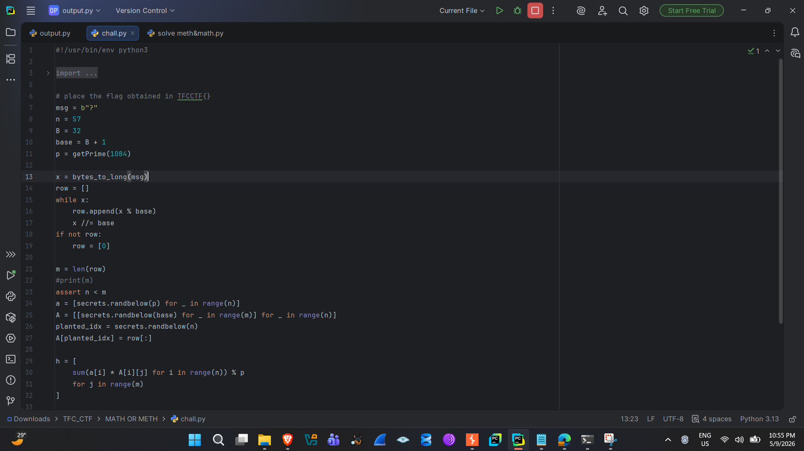
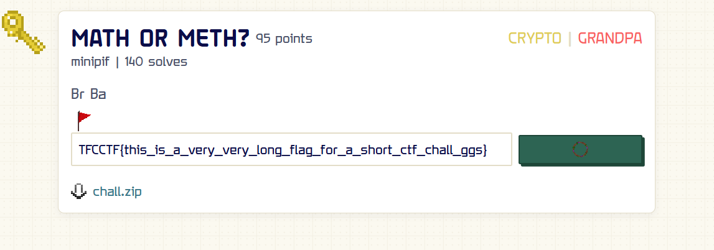
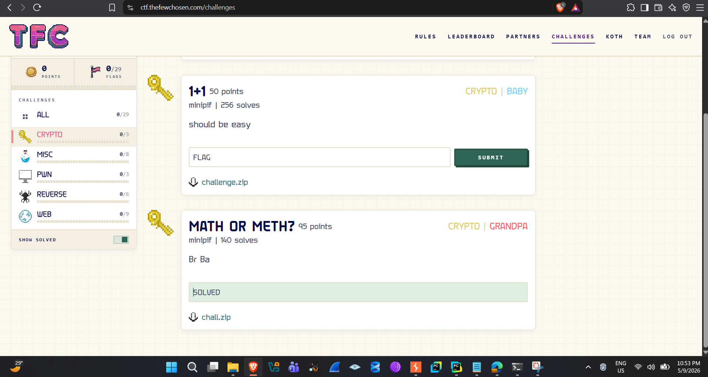

**CTF Writeup**

Math or Meth? --- Crypto / 95 pts

  ----------------- -----------------------------------------------------------------
  **Challenge**     Math or Meth?

  **Category**      Crypto

  **Difficulty**    Grandpa

  **Points**        95

  **Event**         TFC CTF (ctf.thefewchosen.com)

  **Author**        minipif

  **Flag**          TFCCTF{this_is_a_very_very_long_flag_for_a_short_ctf_chall_ggs}
  ----------------- -----------------------------------------------------------------

**1. Challenge Overview**

The challenge provides a single Python source file, chall.py, that
generates an output.py file containing the challenge instance\'s public
parameters. The task is a cryptographic recovery problem: extract a
hidden message (the flag) that has been algebraically mixed into a
single published vector using random secret weights and a random secret
basis.

**2. Source Analysis**

The relevant logic from chall.py is reproduced below (parameters shown
are illustrative of the released instance):

n = 57\
B = 32\
base = B + 1 \# = 33\
p = getPrime(1084)\
\
x = bytes_to_long(msg) \# flag as a big integer\
row = digits of x in base 33 \# \'row\' is the flag re-encoded\
m = len(row) \# length of the flag\'s base-33 encoding\
\
a = \[secrets.randbelow(p) for \_ in range(n)\] \# n secret weights mod
p\
A = \[\[secrets.randbelow(base) for \_ in range(m)\]\
for \_ in range(n)\] \# n random rows, each length m,\
\# entries in \[0, base)\
planted_idx = secrets.randbelow(n)\
A\[planted_idx\] = row\[:\] \# the flag\'s row is planted among the
noise rows\
\
h = \[ sum(a\[i\] \* A\[i\]\[j\] for i in range(n)) % p\
for j in range(m) \] \# h is published; a, A, planted_idx are secret

Only the single vector h (length m), the modulus p, and the dimensions n
and base are published. Every row of A has entries restricted to \[0,
33), and one specific row --- at a secret index --- is not random noise
but the digits of the flag written in base 33. The goal is to recover
that one planted row from h alone.

*Figure 1. chall.py opened in the IDE, showing the parameter setup (n,
B, base, p) and the hidden subset-sum construction.*

**3. Problem Classification**

This construction is a textbook instance of the Hidden Subset Sum
Problem (also called the Hidden Lattice / Hidden Subset-Sum problem),
studied by Nguyen and Stern and revisited in later lattice-cryptanalysis
literature. The setup --- a public vector h that is a secret random
integer combination of n secret small-entry rows, modulo a large prime p
--- is precisely the Nguyen--Stern hidden subset-sum construction, and
it is known to be solvable in polynomial time via lattice reduction
(LLL) whenever the number of samples m is safely larger than n (here m =
88, n = 57, giving a comfortable margin).

**4. Attack Strategy**

The recovery proceeds in four stages:

**4.1 Build the orthogonal lattice**

Every secret row A\[i\] satisfies h ≡ Σ a\[i\]·A\[i\] (mod p).
Equivalently, each row lies in the lattice of integer vectors orthogonal
to h modulo p --- that is, vectors v with v · h ≡ 0 (mod p). This
orthogonal lattice L has rank m and can be constructed directly from h
and p using standard basis vectors of the form (p, 0, \..., 0), (0, p,
0, \...), and a vector built from the modular inverse of one coordinate
of h.

**4.2 LLL-reduce and find the rank gap**

Running LLL (via fpylll/fplll) on the orthogonal lattice produces
reduced basis vectors whose norms separate cleanly into two groups: a
small group of short vectors and a larger group of noticeably longer
ones. This gap appears exactly at index m − n = 88 − 57 = 31, confirming
that the sublattice generated by the n secret rows has been correctly
isolated as the orthogonal complement\'s complement --- i.e., LLL
recovers a basis for the 57-dimensional lattice spanned by the original
secret rows, up to an unknown unimodular transformation.

**4.3 Recover the exact row space**

Because plain LLL on the orthogonal lattice only gives a basis for the
sublattice up to sign and unimodular mixing, an exact kernel computation
is used to pin down the true integer span: an LLL-based
kernel/saturation step (rather than exact rational Gaussian elimination,
which blows up in size on 1084-bit numbers) recovers a clean
57-dimensional lattice whose basis vectors have small entries,
consistent with the original rows and their differences --- i.e.,
vectors of the form A\[i\] − A\[j\], which have entries roughly in
\[−32, 32\] rather than \[0, 32\].

**4.4 Isolate individual rows and decode**

With the difference lattice in hand, the original rows are recovered by
combining basis vectors (adding and subtracting candidate difference
vectors) until every resulting vector\'s entries fall back into the
valid \[0, 32\] range expected of an actual row of A. Each recovered row
is then read as a sequence of base-33 digits, converted back to an
integer with the standard positional-value formula, and turned into
bytes. Repeating this for all 57 candidate rows and checking each
decoded byte string for a valid TFCCTF{\...} pattern identifies the
single planted row --- the others decode to random, non-printable noise.

**5. Solve Script Summary**

\# 1. Load p, h from output.py\
\# 2. Construct the lattice orthogonal to h mod p\
\# 3. LLL-reduce it and confirm the norm gap at index (m - n)\
\# 4. Compute the exact integer kernel / saturation to get the\
\# 57-dim lattice of secret rows (as differences)\
\# 5. Recombine difference vectors -\> individual rows in \[0, base)\
\# 6. For each row: convert base-33 digits -\> integer -\> bytes\
\# 7. Filter for the row that decodes to a printable TFCCTF{\...} string

**6. Result**

Decoding the isolated planted row from base 33 back to bytes yields the
flag:

TFCCTF{this_is_a_very_very_long_flag_for_a_short_ctf_chall_ggs}

Submission confirmed as **SOLVED** on the TFC CTF challenge board:

*Figure 2. Flag accepted on the challenge submission panel.*

*Figure 3. Challenges page showing "Math or Meth?" marked SOLVED under
the Crypto category.*

**7. Takeaways**

-   A single published vector can leak n secret vectors when it is a
    linear combination of them mod a large prime --- this is the Hidden
    Subset Sum Problem, and it is broken by lattice reduction, not brute
    force.

-   LLL against the orthogonal lattice of h is the standard first step;
    the rank gap in the reduced basis norms is the signal that the
    attack succeeded.

-   Working with exact integer kernels (rather than floating-point or
    naive rational elimination) is necessary to avoid coefficient
    blow-up when the modulus is over 1000 bits.

-   Hiding a small-entry secret row among random noise rows of the same
    shape does not add security once the underlying subset-sum structure
    is lattice-solvable.

**8. References**

*Nguyen, P. Q., & Stern, J. --- \"The Hardness of the Hidden Subset Sum
Problem and Its Cryptographic Implications\", CRYPTO 1999.*
