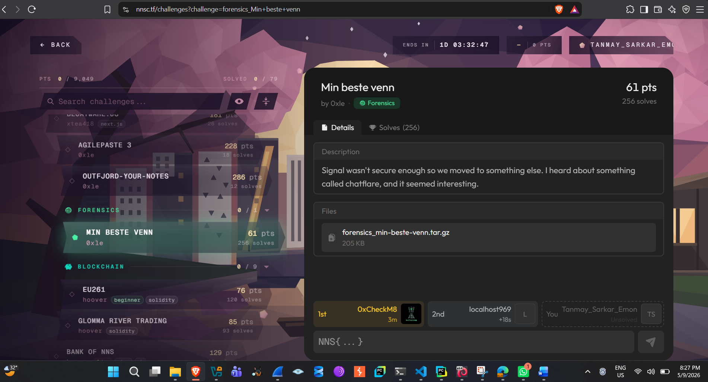
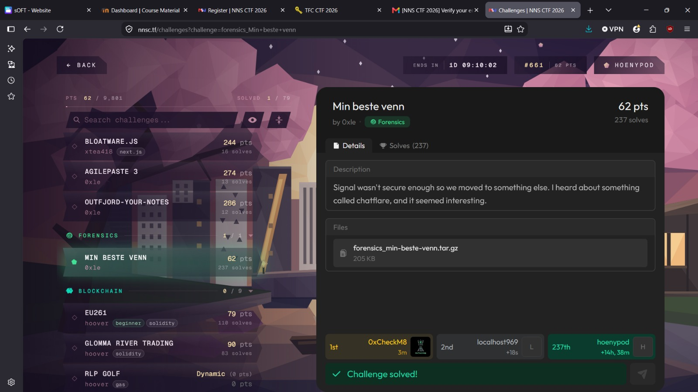
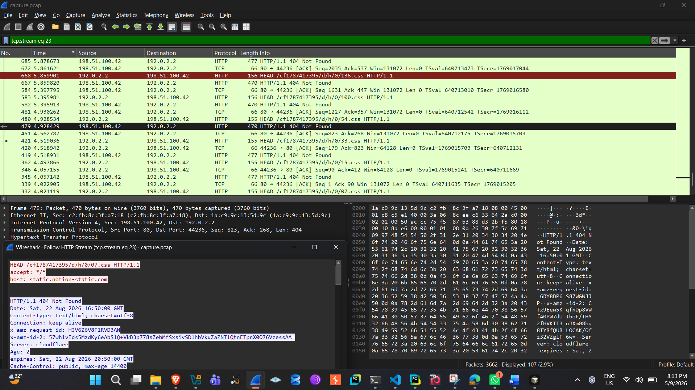
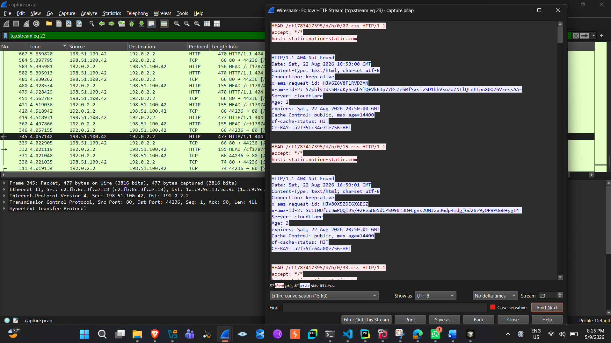
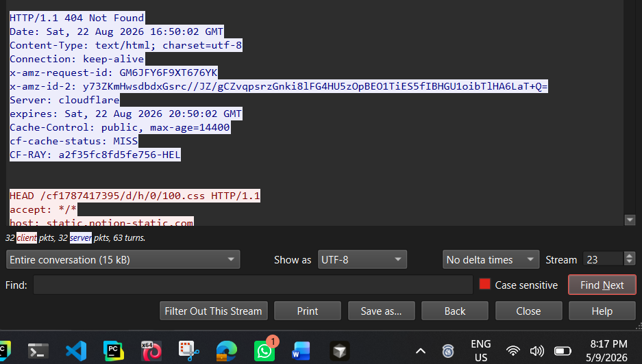

# 1. Challenge Information

  ------------------ ----------------------------------------------------
  **Name**           Min beste venn

  **Category**       Forensics

  **Points**         62

  **Author**         0xle

  **File provided**  capture.pcap (packaged as
                     forensics_min-beste-venn.tar.gz, 205 KB)
  ------------------ ----------------------------------------------------

***Description:** "Signal wasn't secure enough so we moved to something
else. I heard about something called chatflare, and it seemed
interesting."*

*Figure 1 --- Challenge page: "Min beste venn", Forensics, 62 pts, by
0xle*

# 2. Initial Analysis

Opening capture.pcap in Wireshark immediately shows a large amount of
plain HTTP over port 80 traffic between a single client and a single
server:

+-----------------------------------------------------------------------+
| Client: 192.0.2.2                                                     |
|                                                                       |
| Server: 198.51.100.42:80                                              |
+-----------------------------------------------------------------------+

Applying the http display filter reveals 1,135 HTTP requests, and every
single one of them is a HEAD request (not GET) for a .css file, for
example:

+-----------------------------------------------------------------------+
| HEAD /cf1787417395/d/h/0/07.css HTTP/1.1                              |
|                                                                       |
| accept: \*/\*                                                         |
|                                                                       |
| host: static.notion-static.com                                        |
+-----------------------------------------------------------------------+

A few things stand out immediately:

-   The request method is always HEAD --- the client never actually
    wants the content of the file, only the response headers.

-   The Host header (static.notion-static.com) does not match the
    destination IP's actual purpose --- it looks like an attempt to
    blend in with legitimate-looking static asset traffic.

-   The URL paths all begin with a token that looks like
    cf\<10-digit-number\>, followed by short sub-paths such as /h/, /c/,
    /d/h/, and /d/c/.

-   Every response is 404 Not Found --- the requested .css files don't
    exist on the origin server at all.

Despite the 404s, every response carries Cloudflare-specific headers,
most notably:

+-----------------------------------------------------------------------+
| Server: cloudflare                                                    |
|                                                                       |
| Cache-Control: public, max-age=14400                                  |
|                                                                       |
| cf-cache-status: MISS                                                 |
|                                                                       |
| CF-RAY: a2f35faa2e8f7601-HEL                                          |
+-----------------------------------------------------------------------+

*Figure 2 --- Wireshark: full HTTP conversation (tcp.stream eq 23),
packet bytes, and "Follow HTTP Stream" view showing the HEAD
request/response pair*

The presence of cf-cache-status on a 404 response for a file that
doesn't exist is the key anomaly here --- Cloudflare is still caching
these error responses because of the Cache-Control: public,
max-age=14400 header, and it exposes whether a given URL has been served
from cache before (HIT) or not (MISS). This, combined with the
description's mention of "chatflare", is the clue that ties everything
together.

# 3. Identifying Chatflare

"Chatflare" refers to the technique demonstrated in this capture: using
Cloudflare's edge cache as a covert communication channel, instead of
sending any real message content through a request or response body.

The core idea, in beginner-friendly terms:

-   Cloudflare sits in front of an origin server and caches responses
    based on the Cache-Control header the origin sends.

-   If a resource has never been requested before, Cloudflare has to ask
    the origin server for it, and the response is marked
    cf-cache-status: MISS.

-   If that exact same resource is requested again while it is still
    cached, Cloudflare answers directly from its edge cache without
    contacting the origin, and marks the response cf-cache-status: HIT.

-   Crucially, this happens even for error responses (like the 404s seen
    here), as long as the origin's Cache-Control header allows caching.

This means two parties who both have network access to the same
Cloudflare-fronted hostname can use the presence or absence of a cached
object as a one-bit signal, without ever needing a real file to exist, a
real backend service to respond meaningfully, or any actual data to
travel in a request/response body. One side "writes" a bit by requesting
a unique URL (forcing it into cache, or leaving it alone), and the other
side "reads" the bit later by requesting the same URL and checking
whether the response says HIT or MISS.

That is exactly what "chatflare" is doing here: turning the CDN cache
into a shared, binary read/write channel between two participants of a
conversation.

# 4. Wireshark Investigation

The following display filters were used to isolate and understand the
traffic:

  -----------------------------------------------------------------------
  http

  -----------------------------------------------------------------------

Shows all 1,135 HTTP HEAD requests and their responses.

  -----------------------------------------------------------------------
  http.request.uri contains \"/d/\"

  -----------------------------------------------------------------------

Isolates the data-carrying requests (as opposed to the periodic
heartbeat/handshake requests described below).

  -----------------------------------------------------------------------
  http.request.uri contains \"/d/h/\"

  -----------------------------------------------------------------------

Isolates data requests belonging to the "h" direction of the
conversation.

  -----------------------------------------------------------------------
  http.request.uri contains \"/d/c/\"

  -----------------------------------------------------------------------

Isolates data requests belonging to the "c" direction of the
conversation.

  -----------------------------------------------------------------------
  http contains \"cf-cache-status\"

  -----------------------------------------------------------------------

Shows only the HTTP responses, so the HIT/MISS value for each request
can be read directly (Wireshark's http contains filter matches the
header text regardless of case).

*Figure 3 --- Follow HTTP Stream: a request/response pair showing
cf-cache-status: HIT*

*Figure 4 --- Follow HTTP Stream: a request/response pair showing
cf-cache-status: MISS*

# 5. Understanding the Chatflare URL Structure

A representative URL from the capture looks like this:

  -----------------------------------------------------------------------
  /cf1787417395/d/c/1/02.css

  -----------------------------------------------------------------------

Breaking it down component by component:

  ------------------- ---------------------------------------------------
  **Segment**         Meaning

  **cf1787417395**    Session identifier for this conversation. The
                      digits (1787417395) match the Unix timestamp of
                      when the exchange began, so this token acts as a
                      per-session namespace, keeping cache keys for one
                      conversation from colliding with another.

  **d**               Data channel marker. Requests under /d/\... carry
                      an actual bit of the encoded message. (Requests
                      directly under the session root, e.g.
                      /h/s\<timestamp\>.css or /c/s\<timestamp\>.css, are
                      NOT part of the encoded message --- see the note
                      below.)

  **c (2nd segment)** Direction indicator. The capture contains exactly
                      two direction labels, h and c, representing the two
                      sides of the conversation.

  **1**               Message index within that direction. Only the
                      values 0 and 1 appear in this capture --- i.e.,
                      each side sent exactly two messages.

  **02**              Position code. Encodes both a byte number and a bit
                      number in one two-digit value: byte_number =
                      position // 10, bit_number = position % 10 (0--7).
                      Codes ending in 8 or 9 never appear, since a byte
                      has only 8 bits --- confirmed by the real
                      filenames, which jump from \...07.css straight to
                      \...10.css.
  ------------------- ---------------------------------------------------

So /cf1787417395/d/c/1/02.css specifically requests bit 2 (0-indexed) of
byte 0, of message 1, in the "c" direction.

The two non-/d/ request patterns seen in the capture ---
/cf\<session\>/h/s\<timestamp\>.css and
/cf\<session\>/c/s\<timestamp\>.css --- are sent roughly once per second
throughout the whole exchange and are not part of any decoded byte.
Based on their steady, periodic timing, they behave as
heartbeat/synchronization probes used to keep the two sides of the
channel in sync, rather than as message data.

# 6. Understanding CF-Cache-Status

Every response to a /d/\.../\<position\>.css request carries a
cf-cache-status header with one of two values:

+-----------------------------------------------------------------------+
| cf-cache-status: HIT                                                  |
|                                                                       |
| cf-cache-status: MISS                                                 |
+-----------------------------------------------------------------------+

In this challenge:

+-----------------------------------------------------------------------+
| HIT = 1                                                               |
|                                                                       |
| MISS = 0                                                              |
+-----------------------------------------------------------------------+

This is what allows the Cloudflare cache to function as a covert
one-bit-per-URL channel: because every position under a given
session/direction/message maps to a unique, never-reused URL, the sender
can make a URL become cacheable (driving it towards HIT on later
requests) whenever the corresponding bit should be 1, and simply leave a
URL alone (so it stays MISS) whenever the bit should be 0. The receiver
only has to issue the same HEAD request later and read the
cf-cache-status header back --- no message content is ever transmitted
in a request or response body, only the cache state of the edge.

Across the whole capture there are 1,135 HTTP requests in total, of
which 380 responses were HIT and 755 were MISS --- consistent with a
channel where most positions are padding/zero bits and only the '1' bits
needed to be actively cached.

# 7. Extracting the Bits

Each .css request under /d/\<direction\>/\<message\>/\<position\>.css
corresponds to exactly one bit of one byte of one message. For example,
decoding message 1 of direction h, byte 0:

+-----------------------------------------------------------------------+
| position 00 -\> HIT -\> bit 0                                         |
|                                                                       |
| position 01 -\> MISS -\> bit 0                                        |
|                                                                       |
| position 02 -\> MISS -\> bit 0                                        |
|                                                                       |
| position 03 -\> MISS -\> bit 0                                        |
|                                                                       |
| position 04 -\> HIT -\> bit 1                                         |
|                                                                       |
| position 05 -\> MISS -\> bit 0                                        |
|                                                                       |
| position 06 -\> MISS -\> bit 0                                        |
|                                                                       |
| position 07 -\> HIT -\> bit 1                                         |
+-----------------------------------------------------------------------+

Eight bits like this form one byte. The bit at position 0 is the
most-significant bit, and the bit at position 7 is the least-significant
bit --- i.e. standard MSB-first ordering, read left to right exactly as
the positions are numbered.

Putting the above example together:

  -----------------------------------------------------------------------
  00001111

  -----------------------------------------------------------------------

Converting this binary value to hexadecimal and decimal:

  -----------------------------------------------------------------------
  00001111 = 0x0F = 15

  -----------------------------------------------------------------------

Because more than one request for the same position sometimes appears in
the capture (the two sides occasionally re-check a URL before moving
on), the last (most recent) cf-cache-status result observed for a given
position, in chronological order, is the one that should be used ---
earlier probes can be transitional/incomplete and get superseded.

# 8. Discovering the Length Prefix

Decoding byte 0 of message 1 in the "c" direction gives:

  -----------------------------------------------------------------------
  00110110

  -----------------------------------------------------------------------

which is:

  -----------------------------------------------------------------------
  00110110 = 0x36 = 54 (decimal)

  -----------------------------------------------------------------------

This value is not a printable character --- it is a length prefix. Every
message in this protocol begins with one byte stating how many bytes of
text follow it. This matters because it tells us exactly how many
subsequent bytes to decode before stopping, and it explains why the very
first byte of this particular message is not part of the readable text
--- the flag text that follows is 54 bytes long, which is the same
length as NNS{1_l0v3_ch4tt1ng_w1th_m1n_b3st3_v3nn_1n_th3_cl0ud5}.

# 9. Reconstructing the Message

Continuing to decode byte-by-byte and converting each 8-bit group to its
ASCII character:

+-----------------------------------------------------------------------+
| 01001110 = N                                                          |
|                                                                       |
| 01010011 = S                                                          |
|                                                                       |
| 01111011 = {                                                          |
|                                                                       |
| 00110001 = 1                                                          |
|                                                                       |
| 01011111 = \_                                                         |
|                                                                       |
| 01101100 = l                                                          |
+-----------------------------------------------------------------------+

Repeating this process for every remaining byte in each
message/direction reconstructs full lines of readable text. Applying it
to all four message streams found in the capture (h/message 0, c/message
0, h/message 1, c/message 1) recovers a complete, coherent exchange.

# 10. Hidden Conversation

Reconstructing all four decoded messages, in the order their message
indexes (0 then 1) and length-prefix bytes indicate, produces the
following exchange:

+-----------------------------------------------------------------------+
| min beste venn?                                                       |
|                                                                       |
| ja?                                                                   |
|                                                                       |
| can i haz flag?                                                       |
|                                                                       |
| NNS{1_l0v3_ch4tt1ng_w1th_m1n_b3st3_v3nn_1n_th3_cl0ud5}                |
+-----------------------------------------------------------------------+

Based strictly on the URL structure recovered in Section 5, the two
direction labels (h and c) each carried two consecutive messages (index
0 then index 1):

-   **Direction h** sent: min beste venn? (message 0) and can i haz
    flag? (message 1)

-   **Direction c** sent: ja? (message 0) and the flag itself (message
    1)

The pcap does not label h/c with human-readable names beyond these
single letters, so which physical machine or persona each letter
represents is not something that can be confirmed from the traffic alone
--- only the message order and content are verifiable.

# 11. Final Flag

  -----------------------------------------------------------------------
  NNS{1_l0v3_ch4tt1ng_w1th_m1n_b3st3_v3nn_1n_th3_cl0ud5}

  -----------------------------------------------------------------------

# 12. Conclusion

The full recovery chain for this challenge was:

+-----------------------------------------------------------------------+
| PCAP                                                                  |
|                                                                       |
| -\> HTTP traffic (hundreds of HEAD requests to .css paths)            |
|                                                                       |
| -\> suspicious Chatflare-style URLs                                   |
|                                                                       |
| (/cf\<session\>/d/\<direction\>/\<message\>/\<position\>.css)         |
|                                                                       |
| -\> Cloudflare cache status header (cf-cache-status)                  |
|                                                                       |
| -\> HIT/MISS per position                                             |
|                                                                       |
| -\> binary bits (MSB-first, 8 per byte)                               |
|                                                                       |
| -\> bytes                                                             |
|                                                                       |
| -\> ASCII                                                             |
|                                                                       |
| -\> hidden conversation                                               |
|                                                                       |
| -\> flag                                                              |
+-----------------------------------------------------------------------+

The main lesson from Min beste venn is that a covert channel doesn't
need to transmit any actual payload data at all. By abusing a CDN's
caching behavior, two parties can exchange arbitrary binary information
purely through the side effect of whether a resource is cached ---
something that looks, at a glance, like completely unremarkable (and
even broken, 404-returning) web traffic. Forensic analysis of network
captures has to look past "no interesting content in the body" and
consider metadata like cache headers, timing patterns, and URL structure
as potential data channels in their own right.

# 13. Tools Used

-   **Wireshark** --- for initial traffic inspection, protocol
    identification, and filtering HTTP requests/responses.

-   **A small custom script** --- used to automate extraction of the
    cf-cache-status value for each of the 1,135 requests and reassemble
    the bitstream into bytes and ASCII text, since manually reading over
    a thousand individual HIT/MISS values by hand is impractical.

-   **Chatflare** protocol/technique --- the underlying covert-channel
    concept referenced directly by the challenge description.
