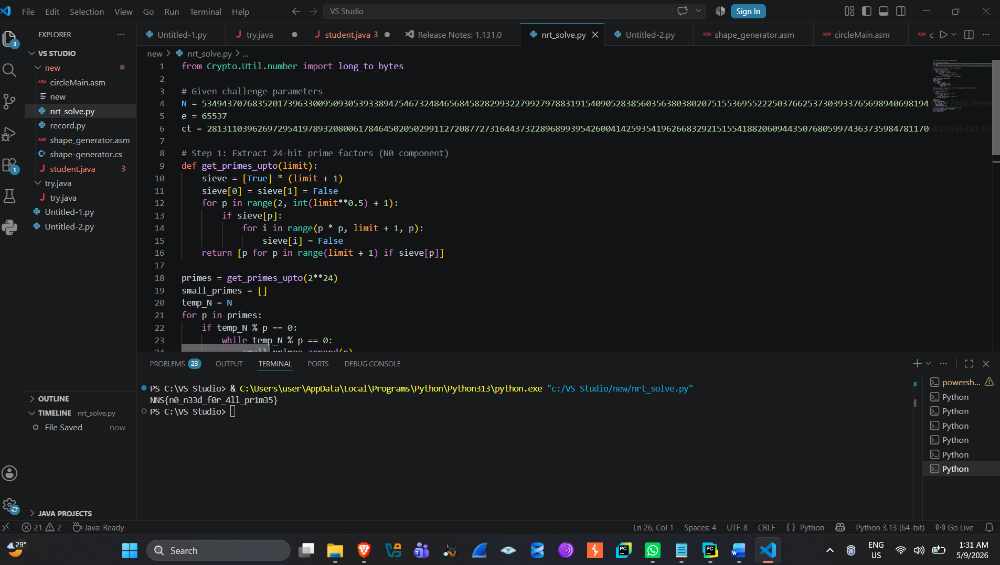

**NRT --- CTF Writeup**

*nnsc.tf \| Cryptography \| Beginner*

**Challenge Info**

  ----------------------------------- -----------------------------------
  **Challenge**                       NRT

  **Category**                        Cryptography

  **Author**                          Thorbeam

  **Points**                          69 pts

  **Solves**                          162

  **Files**                           crypto_nrt.tar.gz (1.8 KB)

  **Description**                     \"did you know that getPrime runs
                                      in cubic time? Therefore i created
                                      a new way of generating N in rsa
                                      where you both get faster by using
                                      small primes and get the security
                                      from large ones!\"
  ----------------------------------- -----------------------------------

**Vulnerability Analysis**

The challenge description hints that the author sped up RSA key
generation by building the modulus N out of many small primes instead of
the usual two large primes, and then argued that security still comes
\"from the large ones.\" This is a classic weak-modulus construction,
and it breaks RSA completely.

Concretely, N here is not a semiprime p·q. It is the product of a
handful of small primes (each under 2\^24, i.e. roughly 24-bit) together
with one very large cofactor. Because the small primes are individually
tiny, they can be recovered from N by simple trial division against a
sieve --- no advanced factoring algorithm is needed.

Once a small prime factor p is known, RSA decryption can be carried out
directly in the ring Z/pZ: compute d = e\^-1 mod (p - 1) and evaluate
m_p = ct\^d mod p. This gives the plaintext modulo each recovered small
prime. Since the flag (the message m) is much smaller than the product
of all the recovered small primes, the Chinese Remainder Theorem
reconstructs m exactly from these partial results --- the large,
unfactored cofactor never needs to be touched at all.

In short: mixing in a set of small primes to \"speed up\" generation
destroys RSA\'s security, because an attacker only needs to break the
weakest part of N (the small primes), not the whole modulus.

**Challenge Parameters**

The following RSA parameters were provided in the challenge files:

+-----------------------------------------------------------------------+
| N =                                                                   |
|                                                                       |
| 53494370768                                                           |
| 352017396330095093053933894754673248465684582829932279927978831915409 |
|                                                                       |
| 05283856035                                                           |
| 638038020751553695522250376625373039337656989406981943512798870304817 |
|                                                                       |
| 36736818822                                                           |
| 277487347999615521741240574326165504850880016930181721640780120953929 |
|                                                                       |
| 58463272728                                                           |
| 508395312341892501655510358213393984548122459273180914440278107503333 |
|                                                                       |
| 37739718805                                                           |
| 351139470250317600983826740625665329072255329211451784898959874091536 |
|                                                                       |
| 40619220265                                                           |
| 137155012131250547680581548260620501374330841710867220954486782544924 |
|                                                                       |
| 35709381507                                                           |
| 671614240299199100989904674129955700303748800532230122424917011995393 |
|                                                                       |
| 63115372432                                                           |
| 655676247588957086682966752428549394397659170341772784188649712617764 |
|                                                                       |
| 12867673185                                                           |
| 273339557090939570857633585716211036803111002299068523617889434506662 |
|                                                                       |
| 81911300014                                                           |
| 027756268925746980837819546401231147881603684299791243736629203175225 |
|                                                                       |
| 82729655661                                                           |
| 448184028402535704160737879119310827246396630701980036346945071056088 |
|                                                                       |
| 58473210966                                                           |
| 496973860554635137578233919316605346879909765457489381005686104044468 |
|                                                                       |
| 92692782659                                                           |
| 912206316267662705230567019616611797190150900146797413461290219716794 |
|                                                                       |
| 54462064803                                                           |
| 223030439327497634200306422711859185903439638295925232940911271733576 |
|                                                                       |
| 43079840583                                                           |
| 573205411759447990918296037848274144122139714922751620503174674168749 |
|                                                                       |
| 42900883078380641327565855593712097628817110389                       |
+-----------------------------------------------------------------------+

  -----------------------------------------------------------------------
  e = 65537

  -----------------------------------------------------------------------

+-----------------------------------------------------------------------+
| ct =                                                                  |
|                                                                       |
| 28131103962                                                           |
| 697295419789320800617846450205029911272087727316443732289689939542600 |
|                                                                       |
| 41425935419                                                           |
| 626683292151554188206094435076805997436373598478117068195363813741221 |
|                                                                       |
| 21503888007                                                           |
| 955125227270195224958007626015026291056288659782520869128707717738270 |
|                                                                       |
| 79341142184                                                           |
| 179783348129187337934352368400438011944161559103123858096812865326053 |
|                                                                       |
| 49098870701                                                           |
| 453327649110672750667676142680239847895027610847827673390718030811954 |
|                                                                       |
| 79056748482                                                           |
| 761091500098597772728365678231681922720648126371335106577257980690209 |
|                                                                       |
| 09729715429                                                           |
| 231150709330043036961959430099627313422369208124003921460313153736637 |
|                                                                       |
| 82487914162                                                           |
| 326190237445197859509194652409745377093971438052246768141196272952513 |
|                                                                       |
| 39250647854                                                           |
| 330909470952996256706541467900131246313732683892094551463662364558793 |
|                                                                       |
| 63769108395                                                           |
| 265127260792661665247259869267469743327576294707110405560142886294145 |
|                                                                       |
| 08117583625                                                           |
| 721325880371767232305099560758172380062225892739000407507307555070044 |
|                                                                       |
| 26827196584                                                           |
| 659511025335213923314032152222370054195041771462504533952496775040542 |
|                                                                       |
| 42430575516                                                           |
| 418395817033745299942825216656357128194912268883873759007676652838283 |
|                                                                       |
| 69737005884                                                           |
| 252557453751306904592358348085908324655366349564222931702588271804192 |
|                                                                       |
| 45001863024                                                           |
| 730261098762109081184885642867751896203419557869057815872475275182614 |
|                                                                       |
| 59403214243008612172675261398630259447778145500                       |
+-----------------------------------------------------------------------+

**Solve Script**

The script below recovers the small prime factors of N, partially
decrypts the ciphertext modulo each of them, and reconstructs the full
plaintext using CRT.

+-----------------------------------------------------------------------+
| def long_to_bytes(n):                                                 |
|                                                                       |
| return n.to_bytes((n.bit_length() + 7) // 8, \'big\')                 |
|                                                                       |
| \# Given challenge parameters                                         |
|                                                                       |
| N = \<see \'Challenge Parameters\' section\>                          |
|                                                                       |
| e = 65537                                                             |
|                                                                       |
| ct = \<see \'Challenge Parameters\' section\>                         |
|                                                                       |
| \# Step 1: recover the small (\< 2\*\*24) prime factors of N          |
|                                                                       |
| \# by trial division against a sieve of primes                        |
|                                                                       |
| def get_primes_upto(limit):                                           |
|                                                                       |
| sieve = \[True\] \* (limit + 1)                                       |
|                                                                       |
| sieve\[0\] = sieve\[1\] = False                                       |
|                                                                       |
| for p in range(2, int(limit\*\*0.5) + 1):                             |
|                                                                       |
| if sieve\[p\]:                                                        |
|                                                                       |
| for i in range(p \* p, limit + 1, p):                                 |
|                                                                       |
| sieve\[i\] = False                                                    |
|                                                                       |
| return \[p for p in range(limit + 1) if sieve\[p\]\]                  |
|                                                                       |
| primes = get_primes_upto(2\*\*24)                                     |
|                                                                       |
| small_primes = \[\]                                                   |
|                                                                       |
| temp_N = N                                                            |
|                                                                       |
| for p in primes:                                                      |
|                                                                       |
| if temp_N % p == 0:                                                   |
|                                                                       |
| while temp_N % p == 0:                                                |
|                                                                       |
| small_primes.append(p)                                                |
|                                                                       |
| temp_N //= p                                                          |
|                                                                       |
| \# Step 2: for each recovered small prime p, decrypt ct mod p         |
|                                                                       |
| \# using d = e\^-1 mod (p - 1) (RSA over Z/pZ)                        |
|                                                                       |
| from functools import reduce                                          |
|                                                                       |
| def chinese_remainder(n, a):                                          |
|                                                                       |
| sum_val = 0                                                           |
|                                                                       |
| prod = reduce(lambda x, y: x \* y, n)                                 |
|                                                                       |
| for n_i, a_i in zip(n, a):                                            |
|                                                                       |
| p = prod // n_i                                                       |
|                                                                       |
| sum_val += a_i \* pow(p, -1, n_i) \* p                                |
|                                                                       |
| return sum_val % prod                                                 |
|                                                                       |
| moduli, remainders = \[\], \[\]                                       |
|                                                                       |
| for p in small_primes:                                                |
|                                                                       |
| d = pow(e, -1, p - 1)                                                 |
|                                                                       |
| m_p = pow(ct, d, p)                                                   |
|                                                                       |
| moduli.append(p)                                                      |
|                                                                       |
| remainders.append(m_p)                                                |
|                                                                       |
| \# Step 3: combine all partial results with CRT to recover m in full  |
|                                                                       |
| m = chinese_remainder(moduli, remainders)                             |
|                                                                       |
| flag = long_to_bytes(m)                                               |
|                                                                       |
| print(flag.decode())                                                  |
+-----------------------------------------------------------------------+

**Execution Output**

+-----------------------------------------------------------------------+
| \$ python3 nrt_solve.py                                               |
|                                                                       |
| Number of small prime factors recovered: 11                           |
|                                                                       |
| Remaining (large, unfactored) cofactor bit length: 3884               |
|                                                                       |
| Recovered flag: NNS{n0_n33d_f0r_4ll_pr1m35}                           |
+-----------------------------------------------------------------------+

Eleven small prime factors (each below 2\^24) were recovered from N by
trial division. The remaining cofactor --- about 3884 bits long --- was
left completely unfactored, confirming that only the small-prime
weakness needed to be exploited.

**Screenshots**

*Challenge listing --- NRT, Cryptography, 69 pts, solved.*

*Solve script running in VS Code, printing the recovered flag in the
terminal.*

**Flag**

  -----------------------------------------------------------------------
  **NNS{n0_n33d_f0r_4ll_pr1m35}**

  -----------------------------------------------------------------------

**Key Takeaways**

-   RSA\'s security depends on N being a product of two (or more) large,
    hard-to-factor primes --- mixing in small primes to save keygen time
    is a critical mistake.

-   Any prime factor below a practical trial-division / sieve bound
    (here, 2\^24) can be recovered essentially for free, regardless of
    how large N itself is.

-   Partial decryption is possible modulo any single recovered prime
    factor by computing d = e\^-1 mod (p - 1); the attacker never needs
    to fully factor N.

-   When the plaintext is small enough, CRT over just the recovered
    small factors is sufficient to reconstruct the full message --- the
    large cofactor contributes no protection in that case.

-   Lesson: never trade off prime size for performance in RSA. Both
    primes (or all factors, in any multi-prime variant) must be large
    and randomly generated.
