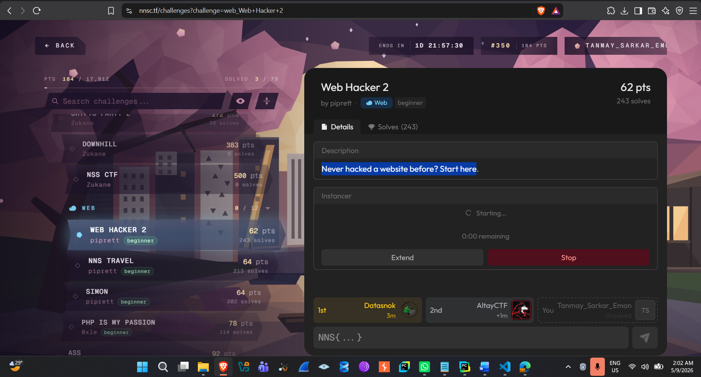
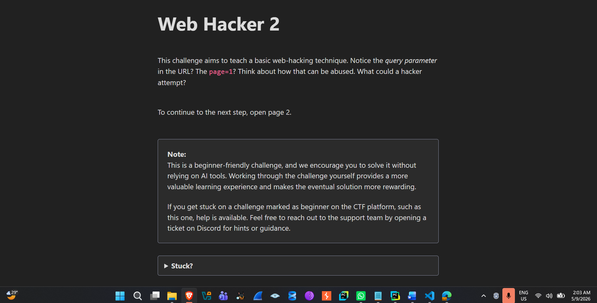
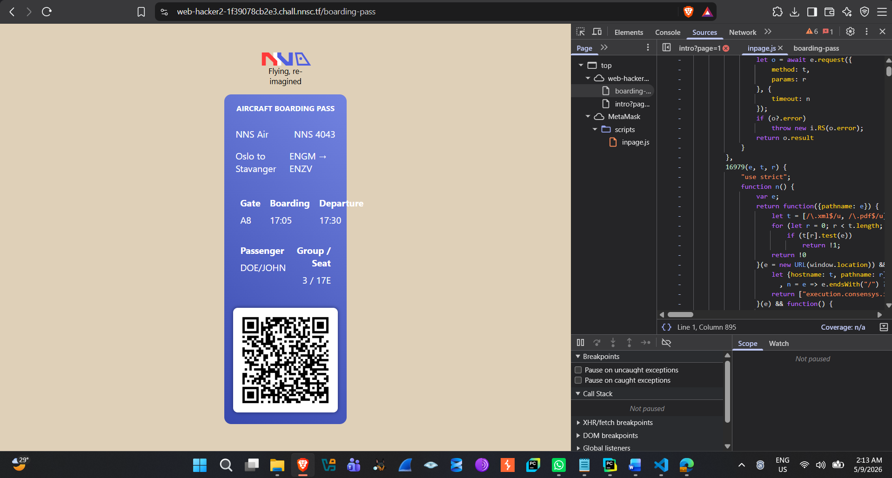
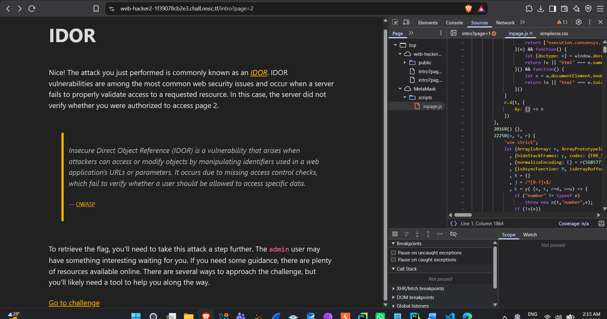
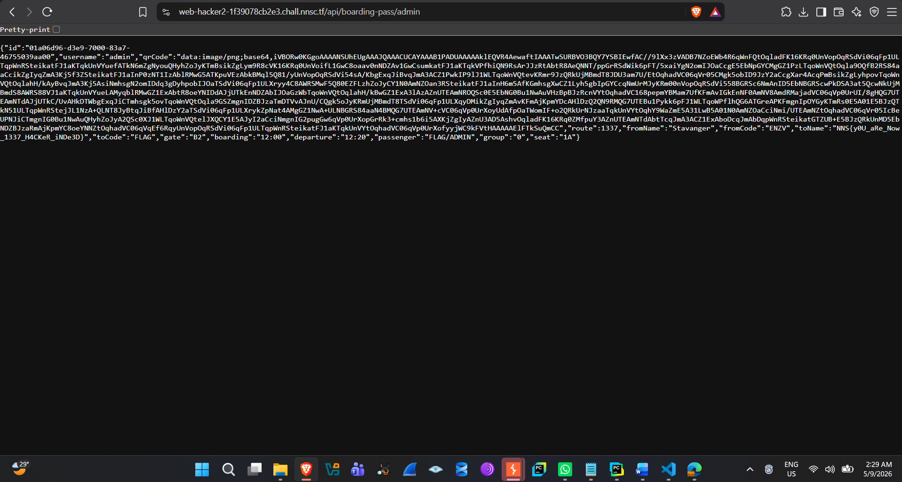
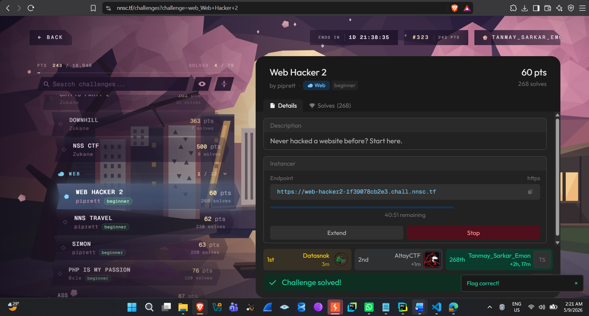

**Web Hacker 2 --- CTF Writeup**

*nnsc.tf \| Web \| Beginner \| IDOR*

# **Challenge Info**

  ------------------- ---------------------------------------------------
  **Challenge**       Web Hacker 2

  **Category**        Web

  **Author**          piprett

  **Points**          60 pts

  **Solves**          268

  **Target**          https://web-hacker2-1f39078cb2e3.chall.nnsc.tf

  **Description**     \"Never hacked a website before? Start here.\"

  **Vulnerability     Insecure Direct Object Reference (IDOR) --- broken
  Class**             object-level access control
  ------------------- ---------------------------------------------------

# **1. Reconnaissance and Initial Exploration**

1.  Access the challenge instance URL,
    https://web-hacker2-1f39078cb2e3.chall.nnsc.tf, which presents a
    beginner-friendly web security lab focused on Insecure Direct Object
    Reference (IDOR).

2.  Navigate through the application to reach the user boarding pass
    page (/boarding-pass), which displays the ticket details for a
    regular user named john.

# **2. Discovering the API Endpoint**

1.  Open Browser Developer Tools (F12) and switch to the Network tab to
    analyze the background HTTP requests made by the page.

2.  Observe that the application fetches the user\'s data via an API
    endpoint:
    https://web-hacker2-1f39078cb2e3.chall.nnsc.tf/api/boarding-pass/john.

3.  Inspect the JSON response and note that it reveals several
    parameters, including username: \"john\", id, route, seat, and a
    base64-encoded qrCode.

# **3. Exploiting IDOR to Target the Admin Account**

1.  Based on the challenge\'s own hint that the admin user \"may have
    something interesting waiting,\" test for an Insecure Direct Object
    Reference (IDOR) vulnerability by replacing the username parameter
    in the API route.

2.  Send a GET request to the modified API endpoint for the admin user:
    https://web-hacker2-1f39078cb2e3.chall.nnsc.tf/api/boarding-pass/admin.

# **4. Retrieving the Flag**

1.  Analyze the JSON response returned from the admin API endpoint,
    which lacks proper authorization controls --- the server never
    checks whether the requesting user is actually allowed to view
    admin\'s data.

2.  Notice that the toName field within the admin\'s boarding pass JSON
    data contains the hidden flag:

3\. NNS{y0U_aRe_Now_1337_H4CKeR_iNDe3D}.

# 

# **Vulnerability Analysis**

The application authenticates and serves boarding-pass data purely based
on a username value taken directly from the URL path, without verifying
that the currently logged-in user is authorized to view that particular
record. This is a textbook Insecure Direct Object Reference (IDOR): the
server exposes an internal object reference (the username) directly in
the API route, and trusts the client to only ever request its own data.

Because there is no server-side access control check tying the requested
username to the authenticated session, any user can simply substitute
another user\'s identifier --- including a privileged account such as
admin --- and receive that account\'s full data in the response,
including sensitive fields not meant to be publicly visible.

# **Screenshots**

*Challenge listing --- Web Hacker 2, Web, beginner, 60 pts.*

*Challenge briefing --- hint about the page query parameter and how it
could be abused.*

*The /boarding-pass page for user \"john\", inspected via DevTools while
exploring the app\'s requests.*

*In-app confirmation identifying the vulnerability class as IDOR, with a
hint to target the admin user next.*

This is the admin page

*Challenge marked solved after retrieving the admin boarding pass and
submitting the flag.*

# **Flag**

  -----------------------------------------------------------------------
  **NNS{y0U_aRe_Now_1337_H4CKeR_iNDe3D}**

  -----------------------------------------------------------------------

# **Key Takeaways**

-   IDOR vulnerabilities arise when an application uses a
    client-supplied identifier (like a username in a URL) to fetch a
    resource without verifying the requester is actually authorized to
    access it.

-   Browser DevTools\' Network tab is often enough to discover the real
    API calls behind a page, even when the frontend never exposes them
    directly.

-   Simply changing a path parameter (e.g. /api/boarding-pass/john →
    /api/boarding-pass/admin) can reveal another user\'s --- or an
    admin\'s --- private data if server-side authorization checks are
    missing.

-   Fix: every object-fetching endpoint must verify server-side that the
    authenticated session is permitted to access the specific object
    being requested, not just that a valid session exists.
