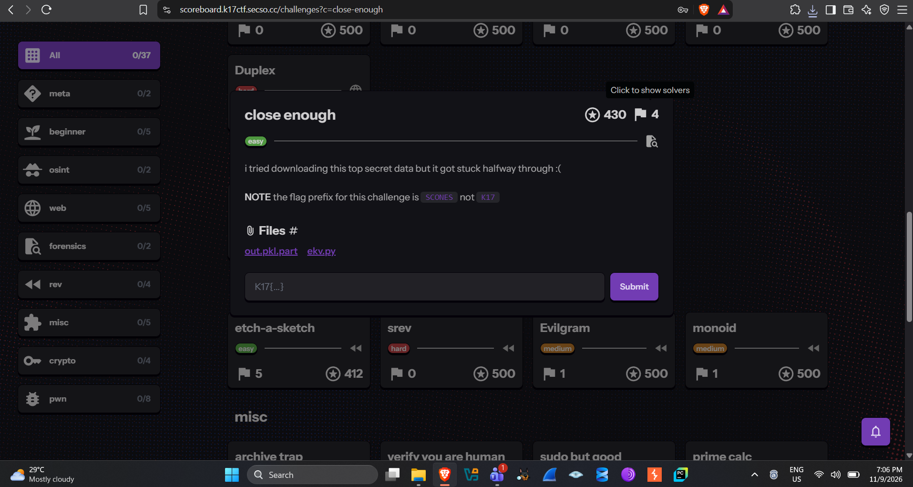
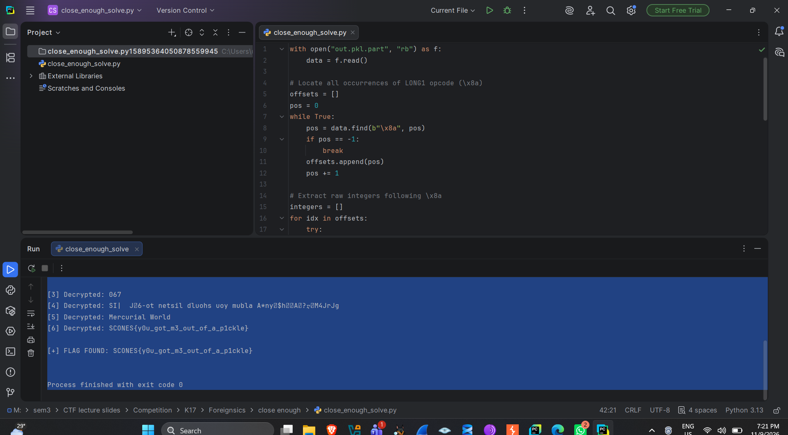
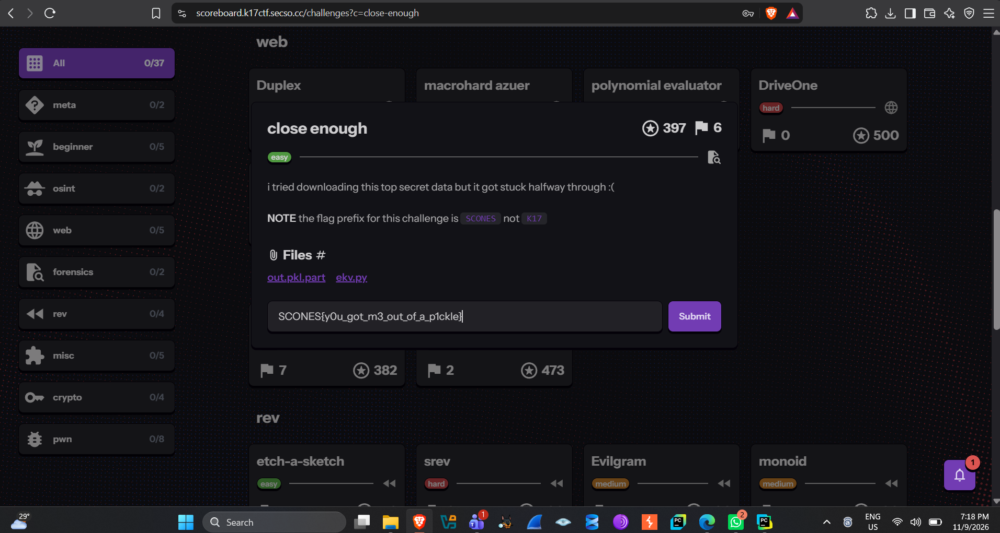
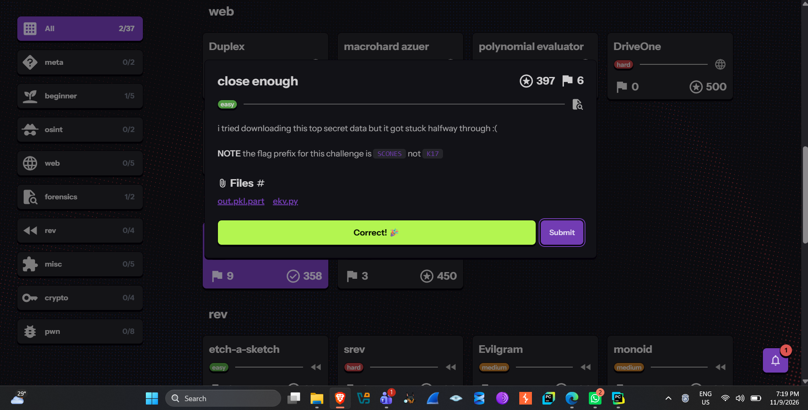

# close enough

*K17 CTF — Forensics*

| | |
|---|---|
| **Category** | Forensics |
| **Difficulty** | Easy |
| **Points** | 500 (dynamic scoring, decays with solves) |
| **Flag Format** | `SCONES{...}` |
| **Files** | `out.pkl.part`, `ekv.py` |

## Challenge description

The author tried to download a "top secret" data file, but the download got interrupted halfway through, leaving a truncated file named `out.pkl.part`. Alongside it is `ekv.py`, which defines a small custom class, `EncryptedKV`, used to XOR-encrypt values before storing them.

Note: the flag prefix for this one is `SCONES`, not the usual `K17` prefix used elsewhere in the CTF.


*Description, flag-prefix note, and attached files (`out.pkl.part`, `ekv.py`).*

## Analyzing ekv.py

```python
class EncryptedKV:
    def __init__(self, secret):
        self.secret = secret
        self.d = {}

    def __getitem__(self, key):
        num: int = (self.d[key] ^ self.secret)
        return num.to_bytes(-(num.bit_length() // -8)).decode()

    def __setitem__(self, key, value):
        self.d[key] = int.from_bytes(value.encode()) ^ self.secret
```

This tells us three things:

- Every stored value is turned into an integer via `int.from_bytes(value.encode())`, then XOR'd with `self.secret` before being placed in `self.d`.
- To recover the original text: `plaintext_int = stored_int XOR secret`, then convert back to bytes and decode.
- Since `self.secret` is an attribute of the object, it gets pickled along with everything else — the secret is embedded inside `out.pkl.part` itself.

## The core problem: a truncated pickle file

If `out.pkl.part` were a complete pickle stream, `pickle.load()` would just work. But the `.pkl.part` extension and the "got stuck halfway through" flavor text both point to an incomplete/corrupted stream — `pickle.load()` raises `UnpicklingError` because the stream ends before all required opcodes are present.

So the object can't just be unpickled as intended — the raw bytes have to be parsed manually to recover the integers written before the cutoff.

## Understanding the pickle byte stream

Pickle is opcode-based: every value is preceded by a single-byte opcode identifying its type. Integers too large for the small fixed-width opcodes (`BININT`/`BININT1`/`BININT2`) use the `LONG1` opcode, `0x8a`, followed by:

- 1 byte: length (in bytes) of the following integer
- N bytes: the integer itself, little-endian, two's-complement

Since `self.secret` and every XOR-encrypted value are large integers, they're all serialized with `LONG1` — and even in a truncated file, any `LONG1` opcode that completes before the cutoff can still be recovered by scanning for `0x8a` and reading its length-prefixed payload.

## Solve script

```python
with open("out.pkl.part", "rb") as f:
    data = f.read()

# Locate all occurrences of LONG1 opcode (\x8a)
offsets = []
pos = 0
while True:
    pos = data.find(b"\x8a", pos)
    if pos == -1:
        break
    offsets.append(pos)
    pos += 1

# Extract raw integers following \x8a
integers = []
for idx in offsets:
    try:
        length = data[idx + 1]
        raw_int_bytes = data[idx + 2: idx + 2 + length]
        if len(raw_int_bytes) == length:
            integers.append(int.from_bytes(raw_int_bytes, "little"))
    except Exception:
        continue

print(f"[*] Found {len(integers)} raw integers.")

if integers:
    # The first integer in the pickle stream is self.secret
    secret = integers[0]

    # Try XORing all other integers against secret
    for i, val in enumerate(integers[1:], 1):
        num = val ^ secret
        try:
            length = -(num.bit_length() // -8)
            decrypted = num.to_bytes(length, "big").decode("utf-8", errors="ignore")
            print(f"[{i}] Decrypted: {decrypted}")
            if "SECSO" in decrypted or "K17" in decrypted or "{" in decrypted:
                print(f"\n[+] FLAG FOUND: {decrypted}\n")
        except Exception:
            continue
```

The script: reads the raw bytes, scans for every `LONG1` opcode, extracts the length-prefixed integer at each occurrence, assumes the first extracted integer is `self.secret` (the first attribute pickled), then XORs every subsequent integer against it and decodes the result as UTF-8 — mirroring `EncryptedKV.__getitem__` exactly.

## Running it

Running the script against `out.pkl.part` recovers several decrypted key/value pairs, including decoy strings and, eventually, the flag:

```
SCONES{y0u_got_m3_out_of_a_p1ckle}
```


*Ends with the flag `SCONES{y0u_got_m3_out_of_a_p1ckle}`.*

A fitting name — the vulnerability is literally about getting secrets "out of a pickle" file even when it's incomplete.

## Final flag

```
SCONES{y0u_got_m3_out_of_a_p1ckle}
```

(Submitted with the `SCONES{...}` prefix per the challenge note, not the usual `K17{...}`.)





## Why this is rated Easy

- No exploitation of pickle's arbitrary-code-execution danger (no `REDUCE`/`GLOBAL` opcode abuse) — just data extraction from a well-documented binary format.
- The `LONG1` opcode structure (`0x8a` + length byte + little-endian integer) is publicly documented (`pickletools`, CPython source), so it can be looked up rather than reverse-engineered.
- The encryption logic is handed over in full via `ekv.py` — no need to guess or brute-force the XOR scheme.
- The whole solve path (find integers → XOR against the first one → decode) is short and the script is under 40 lines.
- The only real hurdle is realizing `pickle.load()` will fail and raw byte-scanning is needed instead — one conceptual leap, not a chain of several hard steps.

## Key takeaways

- Pickle isn't a black box — it can be parsed opcode-by-opcode even when `pickle.load()` itself would fail.
- Custom "encryption" wrappers that store their key as an instance attribute alongside the encrypted data (like `EncryptedKV.self.secret`) are fundamentally insecure, since the key ends up serialized in the same stream as the ciphertext.
- Always check any helper source provided alongside a challenge — `ekv.py` here reveals the exact algorithm needed to reverse the transformation.
