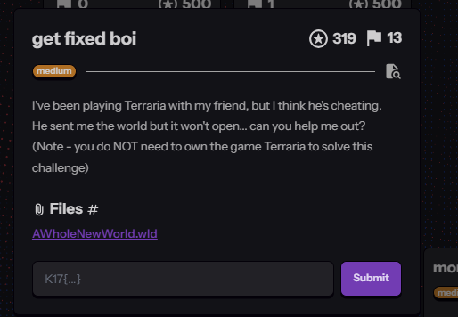
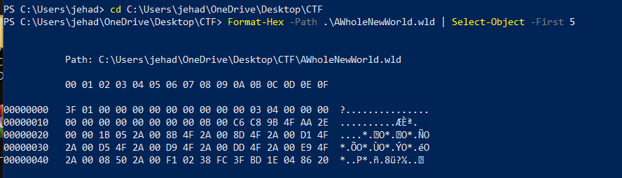
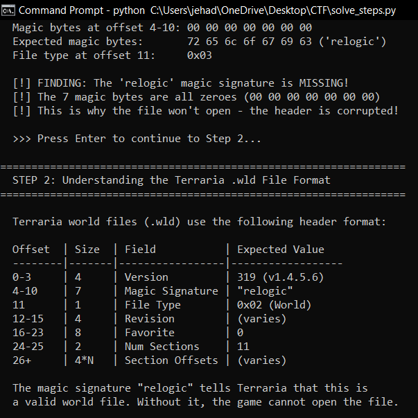
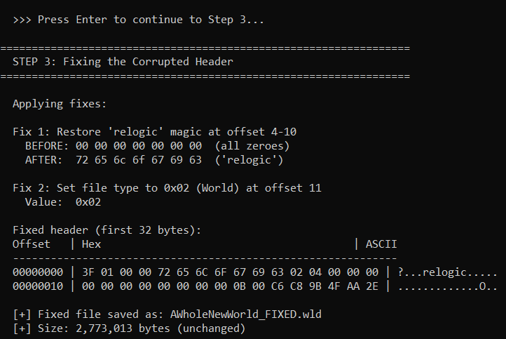
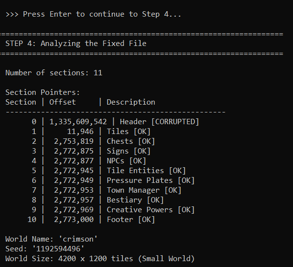
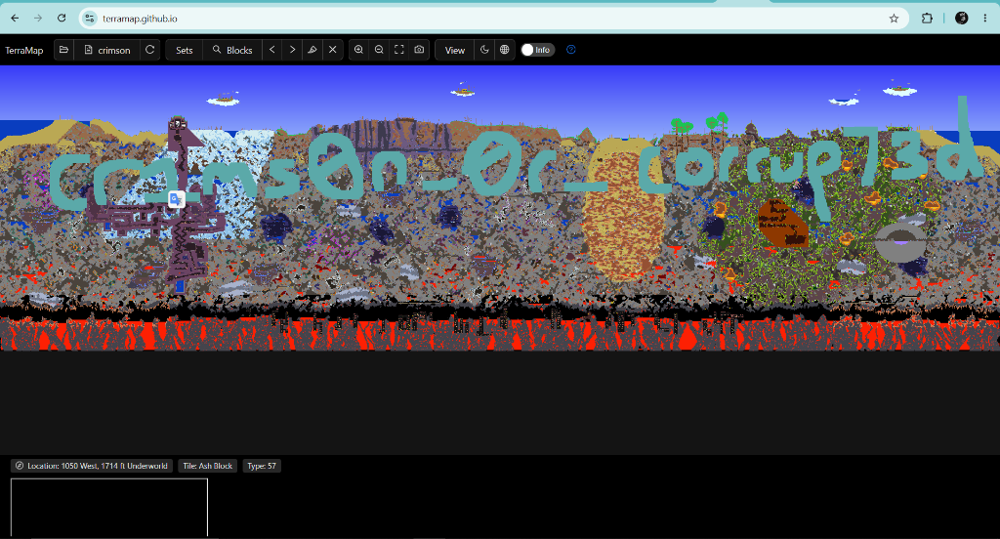
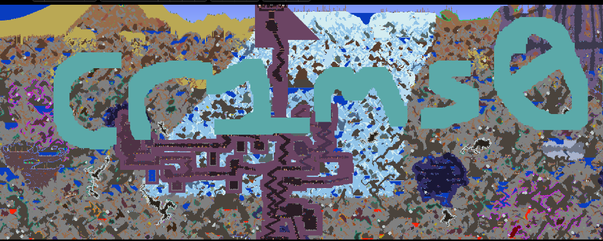
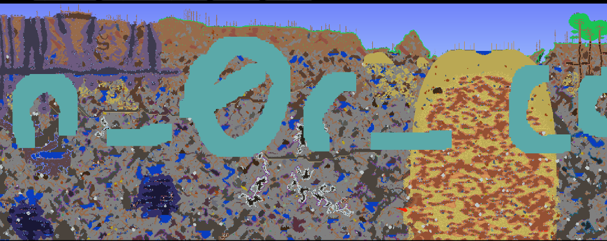
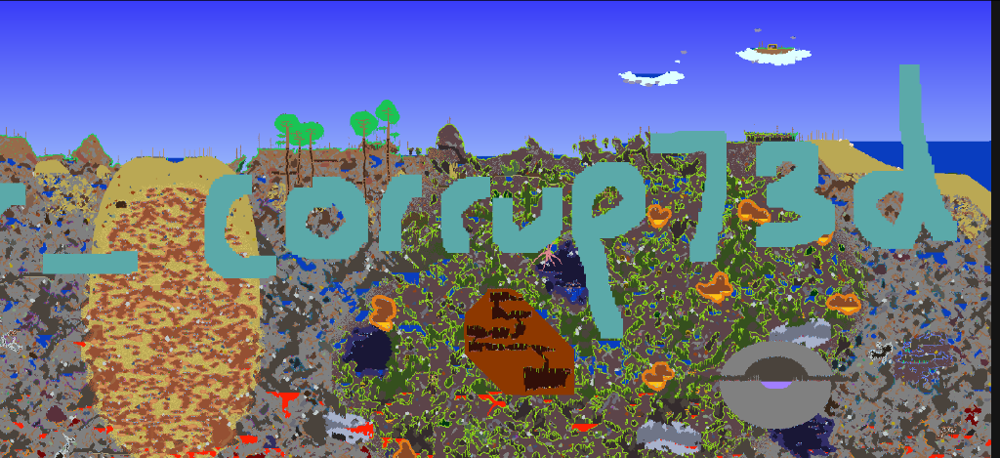
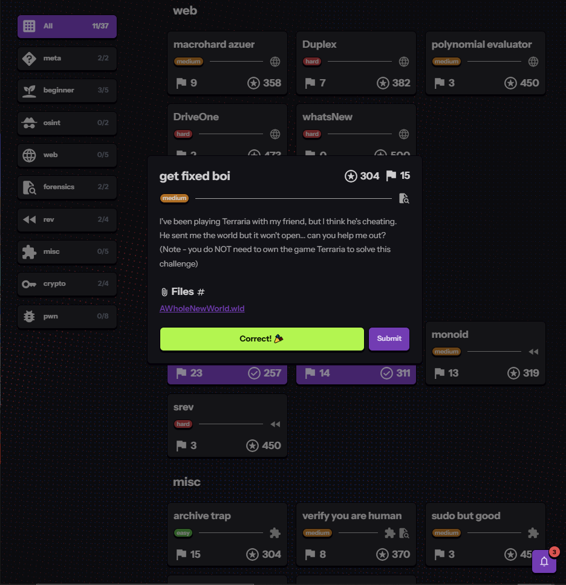

# get fixed boi

*K17 CTF — Forensics*

| | |
|---|---|
| **Category** | Forensics |
| **Difficulty** | Medium |
| **Points** | 304 |

## Challenge description

> "I've been playing Terraria with my friend, but I think he's cheating. He sent me the world but it won't open... can you help me out?"

The challenge also notes that owning Terraria isn't required to solve it. One file is provided: `AWholeNewWorld.wld` (~2.77 MB), a Terraria world save file.

Since this is Forensics and the file "won't open", the natural approach is to check it at the binary level to find out what's wrong.



## Initial file analysis

Examining the raw bytes with PowerShell's `Format-Hex`, the first four bytes (`3F 01 00 00`) decode to 319 in little-endian — but bytes 4 through 10 were all zeroes, which stood out immediately. The rest of the file looked like normal binary data. A file that "won't open" combined with zeroed header bytes strongly suggests header corruption.



## Researching the file format

Terraria's `.wld` format is documented at seancode.com/terrafirma/world.html. The header structure:

| Offset | Size | Field | Expected value |
|---|---|---|---|
| 0–3 | 4 bytes | Version | 319 |
| 4–10 | 7 bytes | Magic Signature | `"relogic"` |
| 11 | 1 byte | File Type | `0x02` (World) |
| 12–15 | 4 bytes | Revision | Varies |
| 24–25 | 2 bytes | Num Sections | 11 |

Bytes 4–10 should contain the ASCII string `"relogic"` (`72 65 6C 6F 67 69 63`) — a magic signature Terraria uses to recognize a valid world file. In the corrupted file, these 7 bytes were all zeroes, which is why the game couldn't recognize the file.

The version number (319) was still intact, confirming the file was from Terraria 1.4.5.6 — so only the magic bytes had been tampered with, and the rest of the world data was likely still fine.



## Fixing the corrupted header

The fix: write the correct `"relogic"` bytes back into positions 4–10. A short Python script reads the corrupted file, replaces the 7 zeroed bytes with the correct ASCII values, sets the file-type byte to `0x02` (World), and saves the result as `AWholeNewWorld_FIXED.wld`. File size stays the same (2,773,013 bytes) since only the corrupted bytes changed.



## Verifying the fixed file

Parsing the section pointers from the header showed 10 of 11 sections had valid offsets pointing to real data. The analysis also revealed the world name: `"crimson"` — one of Terraria's two evil biome types (the other being Corruption). World size was 4200×1200 tiles, corresponding to a Small World.



## Viewing the world in TerraMap

Since Terraria itself isn't owned/needed, [TerraMap Web](https://terramap.github.io/) — a free browser-based `.wld` viewer — was used to render the fixed file directly.

The world rendered successfully, and large text built into the underground layer using teal-colored blocks was immediately visible, spanning almost the entire width of the map — clearly not natural terrain generation.



## Extracting the flag

Zooming into different sections of the text (built from glass blocks) and piecing together left, middle, and right portions:

- Left: `c r 1 m s 0 n`
- Middle: `_ 0 r _`
- Right: `c o r r u p 7 3 d`

Full text: `cr1ms0n_0r_corrup73d` — leetspeak for "Crimson or Corrupted", the two evil biome types in Terraria. A nice thematic touch: the world is named "crimson", and the file header was literally corrupted by zeroing out the magic bytes.







## Final flag

```
K17{cr1ms0n_0r_corrup73d}
```

Submitted and confirmed correct on the K17 CTF platform.



## Tools used

| Tool | Purpose |
|---|---|
| PowerShell | Initial hex dump to inspect raw file bytes |
| Python 3 | Repair script to fix corrupted magic bytes and verify structure |
| TerraMap Web | Browser-based viewer to render the Terraria world map |
| Web Browser | Researching the `.wld` file format documentation |

## Key takeaways

- **Magic bytes are critical.** Many file formats identify themselves with magic numbers/strings; corrupting them prevents apps from opening the file even when the actual data is intact.
- **File format documentation is essential** — without knowing how `.wld` files are structured, the corruption couldn't have been identified or fixed.
- **The right tool makes all the difference** — TerraMap Web allowed viewing the world without owning Terraria, which mattered since the challenge said the game wasn't needed.
- **Challenge names contain hints** — "get fixed boi" directly pointed at the file needing repair, and the cheating-friend story hinted at deliberate file modification.

## References

- Re-Logic. (2024). *Terraria* (Version 1.4.5.6) [Video game]. Re-Logic.
- Sean. (n.d.). Terraria world file format documentation. Terrafirma. https://seancode.com/terrafirma/world.html
- TerraMap Contributors. (n.d.). TerraMap Web – Interactive Terraria world map viewer. GitHub Pages. https://terramap.github.io/
- Python Software Foundation. (2024). `struct` – Interpret bytes as packed binary data. Python Documentation. https://docs.python.org/3/library/struct.html
