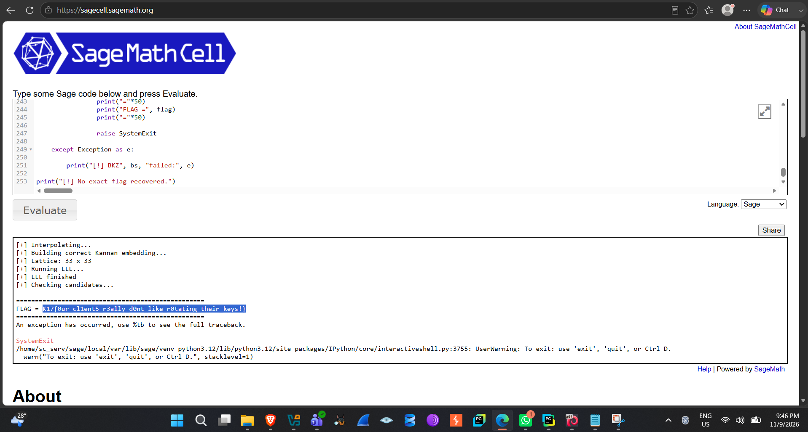
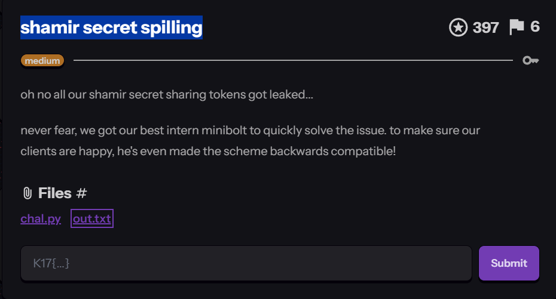

# shamir secret spilling

*Category: Crypto | Difficulty: Medium | Flag format: `K17{...}`*

## Introduction

A medium-difficulty crypto challenge built around Shamir's Secret Sharing. The story: a company's original secret-sharing tokens were leaked, so an intern reissued a new "backwards compatible" scheme to replace it. The goal is to recover a flag hidden as the constant term of a new, upgraded secret polynomial, using only leaked info from the old scheme plus a handful of freshly issued shares from the new one.

Two files are provided: `chal.py` (the logic and constraints) and `out.txt` (the actual numerical output — modulus, coefficient bound, and share values).

## Understanding the challenge

The full source of `chal.py`:

```python
#!/usr/bin/env python3
from secrets import FLAG, MOD, B, P, Q
from Crypto.Util.number import bytes_to_long
from leak import known, new

def polynomial_eval(poly, value):
    res = 0
    for i, coeff in enumerate(poly):
        res += coeff * (value**i)
    return res % MOD

def centered(x):
    x %= MOD
    return x if x <= MOD // 2 else x - MOD

# leaked shamir secret shares are still valid
# for backwards compatibility
assert len(P) == 16
assert len(Q) == 32
assert len(known) == 16
assert len(new) == 8

for x, px in known:
    assert polynomial_eval(P, x) == px
    assert polynomial_eval(Q, x) == px

# freshly issued shares valid for new polynomial
for x, qx in new:
    assert polynomial_eval(Q, x) == qx

# new secret
assert polynomial_eval(Q, 0) == bytes_to_long(FLAG.encode())

for pc, qc in zip(P + [0] * 16, Q):
    assert abs(centered(qc - pc)) < B

## output.txt
print(f"{MOD = }")
print(f"{B = }\n")
print(f"{known = }\n")
print(f"{new = }")
```

Breaking it down:

- **`P`** — a secret degree-15 polynomial (16 coefficients). This is the original, leaked polynomial.
- **`Q`** — a secret degree-31 polynomial (32 coefficients). This is the new, upgraded polynomial.
- **`known`** — 16 `(x, y)` shares valid against *both* `P` and `Q` at the same `x` values — this is what "backwards compatible" means: old shares still work against the new scheme.
- **`new`** — 8 freshly issued `(x, y)` shares valid only against `Q`.
- **`MOD`** — the prime modulus everything is evaluated under.
- **`B`** — a coefficient bound. The final loop pads `P` with 16 zero coefficients to match `Q`'s length, then asserts the *centered* difference between each pair of coefficients is smaller than `B` in absolute value. So `Q`'s coefficients are constrained to sit close to padded `P`'s.
- **`Q(0)`** is asserted to equal `bytes_to_long(FLAG.encode())` — evaluating a polynomial at `x = 0` just returns its constant term, so `Q(0)` *is* the flag as an integer.

`polynomial_eval` sums `coeff * x**i` mod `MOD`. `centered` remaps a value mod `MOD` into the symmetric range `(−MOD/2, MOD/2]`, which matters because a small signed difference (e.g. `−5`) would otherwise look like a huge number close to `MOD` after a plain modular reduction.

## Inspecting the output

`out.txt` gives `MOD`, `B`, the 16 known shares, and the 8 new shares. Both are large integers — `MOD` has just over 160 digits, `B` around 82 digits, consistent with a large prime field:

```
MOD = 13203067321344421022943761138787698807689142264343180023524510577653336076578404038132065721896775905606926086650920345896337685973811841348631724202461677

B = 7588550360256754183279148073529370729071901715047420004889892225542594864082845696
```

(The `known`/`new` lists each contain 16 and 8 large `(x, y)` pairs respectively — omitted here for brevity, see `out.txt`.)

## Reconstructing P

Since `P` has degree 15, it has exactly 16 unknown coefficients, and a degree-15 polynomial is uniquely determined by 16 points. `known` supplies exactly 16 such points, all valid against `P` (and `Q`) per the assertions — so it's precisely enough to reconstruct `P` completely via modular Lagrange interpolation (identical to normal Lagrange interpolation, but every division becomes a modular inverse, which works because `MOD` is prime).

`P` was interpolated in SageMath using the 16 `known` points and `MOD`.

## Understanding Q and the difference polynomial

Once `P` is known, define the difference polynomial `D = Q − (P padded with 16 zeros)`, coefficient by coefficient. The final assertion in `chal.py` says every coefficient of `D`, once centered mod `MOD`, has absolute value smaller than `B`.

That has two consequences:

- For coefficient indices 0–15, `D` is the small, bounded amount by which `Q`'s coefficient differs from the already-known `P` coefficient.
- For indices 16–31, padded `P` is zero, so `D` *is* `Q`'s coefficient directly — the entire "high half" of `Q` is unknown but bounded by `B`.

Since `B` (~10⁸²) is vastly smaller than `MOD` (~10¹⁶⁰), this turns "find `Q`" into "find a vector of 32 unknown small integers satisfying 8 modular linear equations from `new`" — exactly the shape lattice reduction is built for.

## Lattice attack

The 8 equations from `new` give 8 modular linear constraints on `Q`'s 32 coefficients. Combined with the bound `|D_i| < B`, this is a textbook lattice attack:

- Build a lattice basis encoding the modular equations from `new` together with `MOD` (so solutions can be found modulo `MOD`), with the unknown `D` coefficients as the target vector.
- Since this is a Closest Vector Problem rather than a plain Shortest Vector Problem, use **Kannan's embedding**: append an extra row/column encoding the known target with a large embedding constant, turning the CVP into an SVP instance that LLL can solve directly.
- Run **LLL** on the augmented basis to get a reduced set of candidate vectors.
- Check the resulting short vectors for one that, added back to padded `P`, gives `Q` coefficients that decode to a readable flag.

## Debugging along the way

A few issues came up building the SageMath solve script before it worked:

- **`FileNotFoundError` on `out(2).txt`** — the browser had saved a second copy of `out.txt` with a `(2)` suffix, and the script pointed at the wrong filename. Fixed by correcting the path.
- **`NameError: MOD is not defined`** — a cell referenced `MOD` before the cell parsing it from `out.txt` had run (a common SageCell/Jupyter out-of-order issue). Fixed by running cells in the right order.
- **`NameError: known is not defined`** — same class of issue, same fix.
- **`NameError: IntegerLattice is not defined`** — the class hadn't been imported before use. Fixed by adding the import.
- **LLL candidates that didn't decode to a valid flag** — indicated the embedding itself wasn't correctly capturing the problem yet, not a bytes-conversion issue. Led to revisiting the embedding construction.
- **BKZ "unknown algorithm" error** — a BKZ reduction was tried as a stronger fallback over plain LLL but failed; the final script wraps the BKZ call in a `try/except` printing `[!] BKZ <block size> failed: <error>`, suggesting it was meant as a fallback across multiple block sizes.
- **"Direct embedded vector not found"** — the first embedded-lattice search didn't locate the target vector among the reduced basis rows, pointing at the same embedding issue above.

## Successful recovery

The working script used a corrected Kannan embedding to turn the CVP into an SVP instance solvable by LLL. The tail of the final script:

```python
print("="*50)
print("FLAG =", flag)
print("="*50)
raise SystemExit
except Exception as e:
    print("[!] BKZ", bs, "failed:", e)
print("[!] No exact flag recovered.")
```

The script deliberately raises `SystemExit` once a flag is found — explaining the "An exception has occurred" message right after the flag prints; it's an intentional exit, not a crash.

The full pipeline: interpolate `P` → build the corrected Kannan embedding → run LLL on the resulting 33×33 lattice (32 unknown coefficients + 1 embedding dimension) → check candidate vectors from the reduced basis. One candidate, converted from integer to bytes, produced a clean, correctly formatted flag.


*The corrected Kannan embedding, a 33×33 lattice, LLL completing, and the recovered flag printed to the console.*

## Final flag

```
K17{0ur_cl1ents_r3ally_d0nt_like_r0tating_their_keys!}
```




## Conclusion

The vulnerability here is in how the "backwards compatible" upgrade was designed: instead of an entirely independent new secret polynomial `Q`, its coefficients were constrained to differ from the old, partially-leaked `P` by only a small bounded amount. Combined with old shares still validating against both `P` and `Q`, this leaked far more structure about the "new" secret than intended.

Interpolating `P` from the 16 known shares was step one. From there, the coefficient bound `B` let `Q` be written as padded `P` plus a small bounded difference vector `D`, turning "find all 32 coefficients of `Q`" into "find a small integer vector satisfying a handful of modular linear equations" — exactly what lattice reduction solves. After some debugging, a corrected Kannan embedding combined with LLL recovered `D`, and therefore `Q`. Evaluating `Q(0)` gave the flag directly.
